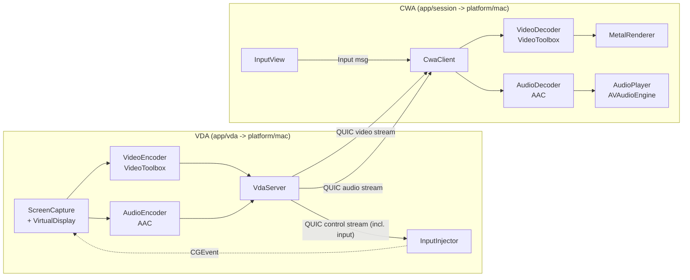

# Nebula — ARCHITECTURE

> This document covers the **native QUIC path**'s layering, component map, and
> wire protocol in detail. For the full system picture — including the
> WebRTC/browser path, the relay's NAT-traversal/reconnect design, and the
> optional SaaS control plane — see **[ARCHITECTURE_OVERVIEW.md](./ARCHITECTURE_OVERVIEW.md)**
> (中文), **[NAT_TRAVERSAL.md](./NAT_TRAVERSAL.md)**, and **[ROADMAP.md](./ROADMAP.md)**.

## 1. Overview

Nebula is a **macOS-only** remote display framework modeled on the icagraphics
VDA→CWA pipeline. A **VDA** (the shared Mac) captures a mandatory virtual
display and system audio, hardware-encodes them, and streams over **QUIC**
(Apple Network.framework) to a **CWA** viewer that hardware-decodes and
renders with Metal / plays with Core Audio. A `nebula_relay` can bridge NAT'd
peers and the connection best-effort upgrades to a direct path afterwards
(§10). Separately, an optional `WebRtcGateway` fans the same encoded frames
out to browser viewers over standard WebRTC (§10), and an optional
`nebula_cloud` SaaS service adds accounts/sharing/tickets on top (§10).

Design priority: **lowest possible latency** (real-time encoders, zero-copy GPU
textures, independent QUIC streams for video/audio/control).

Naming: namespace `nebula::`, public interfaces prefixed `I`, types prefixed `Nebula`.

## 2. Layered architecture

| Layer | Responsibility | Side | May depend on |
|-------|----------------|------|----------------|
| **App / Orchestration** (`VdaServer` / `CwaClient`) | Wire pipeline, lifecycle | both | everything below |
| **Capture** (`ScreenCapture` + `VirtualDisplay`) | Virtual-display + system audio frames | VDA | Platform, Core |
| **Codec** (VideoToolbox / AudioToolbox, + `OpusAudioEncoder`) | HW encode (VDA) / decode (CWA) | both | Core |
| **Render / Playback** (`MetalRenderer` / `AudioPlayer`) | Present video, play audio | CWA | Core |
| **Input** (`InputView` / `InputInjector`) | Capture local input (CWA) / inject via `CGEvent` (VDA) | both | Core |
| **Transport** (`QuicTransport`, `RelayTransport`, `UpgradingTransport`) | QUIC connection + streams, relay bridging, direct-path upgrade | both | Core |
| **Browser gateway** (`WebRtcSession` / `WebRtcGateway`, optional) | ICE/DTLS/SRTP fan-out to browsers | VDA | Core |
| **Protocol** (`NebulaProtocol`, `RelayProtocol`) | Wire framing, message types, caps | both | — |
| **Core / Utils** (`NebulaLog`, `NebulaTypes`, `NebulaCrypto`) | Logging, basic types, session encryption | both | — |



## 3. Component map

Actual on-disk layout (see [README.md](./README.md) `## Layout` for the
top-level summary):

### core/  (portable C++, no Apple types; `nebula_core` target)
| File | Role |
|------|------|
| `inc/NebulaTypes.h`, `inc/NebulaFrame.h` | Codec enums, `VideoConfig`/`AudioConfig`/`NebulaCaps`, non-owning raw frame views |
| `inc/NebulaLog.h` / `src/NebulaLog.cpp` | Lightweight os_log-backed logging |
| `inc/NebulaProtocol.h` / `src/NebulaProtocol.cpp` | Frame header (de)serialization, message types |
| `inc/NebulaCrypto.h` / `src/NebulaCrypto.cpp` | ChaCha20-Poly1305 session encryption (§4a) |
| `inc/NebulaInput.h` | `NebulaInputEvent` wire struct + encode/decode (§8) |
| `inc/RelayProtocol.h` | `nebula_relay` hello/status/reconnect-ticket wire format (header-only) |
| `inc/Signaling.h` / `src/Signaling.cpp` | `ISignaling` abstraction; only `DirectSignaling` (host:port, no negotiation) implemented today |
| `inc/SessionStatus.h` | `nebula_session` → Flutter manager lifecycle contract (`NEBULA_STATUS:` stdout lines) |
| `inc/OpusAudioEncoder.h` / `src/OpusAudioEncoder.cpp` | Opus encode, used only by the WebRTC path |
| `inc/WebRtcSession.h` / `src/WebRtcSession.cpp` | One browser viewer's `rtc::PeerConnection` wrapper (libdatachannel) |
| `inc/WebRtcGateway.h` / `src/WebRtcGateway.cpp` | Owns the WS signaling connection + one `WebRtcSession` per viewer |
| `inc/Transport.h` | Portable `ITransport` (Control/Video/Audio/Upgrade channels; Quic/Relay backends) |
| `inc/ScreenCapture.h`, `inc/VideoEncoder.h`, `inc/VideoDecoder.h`, `inc/AudioEncoder.h`, `inc/AudioDecoder.h`, `inc/InputInjector.h` | Portable capability interfaces (`IScreenCapture`, `IVideoEncoder`, ... — take `RawVideoFrame`/`RawAudioFrame`, no Apple types); macOS impl lives in `platform/mac/src/*.mm` |
| `inc/VdaServer.h`, `inc/CwaClient.h` / `src/VdaServer.mm`, `src/CwaClient.mm` | Pipeline orchestration (built into `nebula_mac`; `.mm` for now, portable `.cpp` is P3) |
| `inc/FrameReader.h`, `inc/AnnexB.h`, `inc/LocalAddr.h`, `inc/IRenderer.h`, `inc/IAudioPlayer.h`, `inc/IInputCapture.h`, `inc/IProcessSpawner.h` | Frame reassembly, H.264 Annex-B helpers, local-address discovery, remaining portable capability interfaces |

### platform/mac/  (macOS backends; `nebula_mac` static library)
| File | Role |
|------|------|
| `src/ScreenCapture.mm` | Implements `IScreenCapture` on `SCStream` (video + system audio callbacks) |
| `inc/VirtualDisplay.h` / `src/VirtualDisplay.mm` | `CGVirtualDisplay`-backed mandatory capture target |
| `src/VideoEncoder.mm` / `VideoDecoder.mm` | Implements `IVideoEncoder`/`IVideoDecoder` via `VTCompressionSession`/`VTDecompressionSession` (HEVC/H.264) |
| `src/AudioEncoder.mm` / `AudioDecoder.mm` | Implements `IAudioEncoder`/`IAudioDecoder` via `AudioConverter` ↔ AAC |
| `inc/MetalRenderer.h` / `src/MetalRenderer.mm` | `CVMetalTextureCache`, YUV→RGB shader, present |
| `inc/AudioPlayer.h` / `src/AudioPlayer.mm` | `AVAudioEngine` PCM playback |
| `src/InputInjector.mm` | Implements `IInputInjector`: `CGEvent` injection (VDA) |
| `inc/InputView.h` / `src/InputView.mm` | Mouse+keyboard capture `NSView` (CWA) |
| `src/QuicTransport.mm` | Network.framework QUIC listener/connection + per-purpose streams (direct `ITransport` backend) |
| `src/RelayTransport.mm` | Speaks `RelayProtocol` to bridge through `nebula_relay` (relay `ITransport` backend) |
| `src/UpgradingTransport.mm` | Runs relay + direct candidates in parallel, switches to direct when reachable, falls back on loss |
| `src/ProcessSpawner.mm` | VDA/manager side process spawn helper (`IProcessSpawner`) |
| `inc/AppDelegate.h` / `src/AppDelegate.mm` (used by `app/session`) | Cocoa window hosting the `CAMetalLayer` |

### app/  (entry points)
| Path | Role |
|------|------|
| `app/vda/main.mm` | `nebula_vda` entry point — CLI args for port/codec/bitrate/relay/WebRTC |
| `app/session/main.mm` | `nebula_session` entry point — CLI args for host/port/relay; secrets via env |
| `app/manager/lib/*.dart` | Flutter GUI: manage a list of VDAs, spawn/supervise `nebula_session` |

## 4. Wire protocol

All messages share a fixed 24-byte little-endian header (`NebulaFrameHeader`):

| Field | Type | Bytes | Notes |
|-------|------|-------|-------|
| magic | u32 | 4 | `kNebulaMagic` = 0x5542454E ("NEBU") |
| version | u8 | 1 | protocol version (2) |
| type | u8 | 1 | `MsgType` |
| flags | u16 | 2 | bit0=keyframe, bit1=config(SPS/PPS or AAC ASC) |
| length | u32 | 4 | payload length (ciphertext length once encrypted, see §4a) |
| seq | u32 | 4 | per-channel, per-sender sequence — also the AEAD nonce input |
| timestampUs | u64 | 8 | capture/presentation time (µs) |

`MsgType`: `HELLO=1, HELLO_ACK=2, VIDEO=3, AUDIO=4, INPUT=5, BYE=6, KEY_INIT=7, KEY_INIT_ACK=8`.

### 4a. Session encryption — the header is cleartext, the payload is not [IMPLEMENTED]

Every payload except `KEY_INIT`/`KEY_INIT_ACK` is sealed with ChaCha20-Poly1305
(IETF, via libsodium) before it reaches `ITransport::send()` — this applies
identically over the direct QUIC transport and over a `nebula_relay` bridge, so
the relay only ever sees ciphertext (see `core/inc/NebulaCrypto.h`).

- **Handshake**: the CWA opens the Control channel with `KEY_INIT` (cleartext,
  carries a random 16-byte salt); the VDA replies `KEY_INIT_ACK` (cleartext,
  its own random 16-byte salt). Both sides derive a 256-bit session key via
  `HKDF-SHA256(salt = saltCWA‖saltVDA, ikm = PSK, info = "nebula-session-v1")`.
  A fresh salt pair each connection means a fresh key each connection, even
  though the PSK itself is long-lived.
- **Nonce**: 12 bytes = `channel(1) ‖ senderIsVda(1) ‖ reserved(2) ‖ seq(8, BE)`.
  Reusing the header's existing `seq` costs no wire-format change and gives
  replay protection for free: a decrypt with a non-increasing `seq` for that
  (channel, sender) pair is rejected.
- **AAD**: the message's own 24-byte cleartext header, so a ciphertext can't
  be replayed under a different header (type/flags/length/seq/timestamp).
- Everything after the handshake — `HELLO`/`HELLO_ACK`/`VIDEO`/`AUDIO`/`INPUT`/`BYE` —
  is rejected if received before the handshake completes, or if it fails to
  decrypt (wrong PSK, corruption, or tampering).

### Stream usage (independent QUIC connections — no cross-blocking)
Each logical channel runs on its **own client-initiated QUIC connection**. QUIC
connections are bidirectional, so the server streams media back on the Video/Audio
connections the client opens. Independent connections guarantee video/audio/control
never head-of-line block each other. (A future optimization can fold these into a
single multiplexed QUIC connection with per-stream IDs.)
- **Control**: `KEY_INIT`/`KEY_INIT_ACK` handshake, then `HELLO`/`HELLO_ACK` caps
  exchange, then `INPUT`.
- **Video** (server→client media on the client-opened connection): VIDEO frames; first flagged `config`.
- **Audio** (server→client media on the client-opened connection): AUDIO frames; first flagged `config` (AAC magic cookie).

Each connection is prefixed by a 4-byte channel id so the server can route it.
TLS uses an embedded self-signed identity (dev) with a trust-all client verify;
replace both for production. (This TLS layer is orthogonal to the §4a
application-layer encryption — even if the TLS trust model is weak, the
Nebula payload underneath is still authenticated and only readable by holders
of the shared PSK.)

### Capabilities (`NebulaCaps`) exchanged in HELLO/HELLO_ACK payload
`{ videoCodec, width, height, fps, audioSampleRate, audioChannels, audioCodec }`.

The CWA always sends its main screen's logical width and height. The VDA rejects
missing/zero dimensions, creates a virtual display of exactly that geometry, and
captures only that display. Virtual-display creation failure is fatal; physical
display fallback is intentionally unsupported.

## 5. Key interfaces

All capability interfaces are portable (`core/inc/`) and exchange only
`RawVideoFrame`/`RawAudioFrame`/`EncodedFrame` (`core/inc/NebulaFrame.h`,
`NebulaTypes.h`) — never Apple types directly; a `nativeHandle` slot lets the
same-platform backend do a zero-copy hand-off (e.g. a `CVPixelBufferRef`)
without Core code ever dereferencing it. The macOS implementations live in
`platform/mac/src/*.mm`.

```cpp
// Transport — core/inc/Transport.h
class ITransport {
public:
  enum class Channel : uint32_t { Control = 0, Video = 1, Audio = 2, Upgrade = 3 };
  using RecvCb  = std::function<void(Channel, const uint8_t*, size_t)>;
  using StateCb = std::function<void(bool connected)>;
  virtual void setSharedSecret(const std::string& secret) = 0;
  virtual void configureRelay(const std::string& relayHost, uint16_t relayPort,
                              const std::string& deviceId, const std::string& token,
                              bool isVda, const std::string& ticket = "") {}
  virtual bool startListener(uint16_t port) = 0;               // VDA
  virtual bool connect(const std::string& host, uint16_t) = 0; // CWA
  virtual bool send(Channel, const uint8_t* data, size_t len) = 0;
  virtual void setOnReceive(RecvCb) = 0;
  virtual void setOnState(StateCb) = 0;
  virtual void close() = 0;
};
// CreateTransport(TransportType::Quic | Relay) picks the concrete backend
// (QuicTransport.mm direct, or RelayTransport.mm / UpgradingTransport.mm).
```

```cpp
// VDA encoder — core/inc/VideoEncoder.h (impl: platform/mac/src/VideoEncoder.mm)
class IVideoEncoder {
public:
  using OutputCb = std::function<void(const EncodedFrame&)>;
  virtual bool start(const VideoConfig&) = 0;
  virtual void setOutput(OutputCb) = 0;
  virtual void encode(const RawVideoFrame& frame) = 0; // frame.nativeHandle: CVPixelBufferRef
  virtual void forceKeyframe() = 0; // wired to RTCP PLI/FIR on the WebRTC path
  virtual void stop() = 0;
};
```

```cpp
// CWA decoder — core/inc/VideoDecoder.h (impl: platform/mac/src/VideoDecoder.mm)
class IVideoDecoder {
public:
  using FrameCb = std::function<void(const RawVideoFrame& frame)>; // nativeHandle: CVImageBufferRef
  virtual bool start(const VideoConfig&) = 0;
  virtual void setOutput(FrameCb) = 0;
  virtual void setConfig(const uint8_t* data, size_t len) = 0; // parameter sets
  virtual void decode(const uint8_t* data, size_t len, bool keyframe, uint64_t ptsUs) = 0;
  virtual void stop() = 0;
};
```

## 6. Performance invariants

- **Zero-copy video**: encoder consumes the `CVPixelBufferRef` from SCStream directly;
  decoder output `CVPixelBuffer` is wrapped as a Metal texture via `CVMetalTextureCache`
  (no CPU readback).
- **HW only**: VTCompressionSession with
  `kVTVideoEncoderSpecification_EnableHardwareAcceleratedVideoEncoder = true`,
  RealTime + low-latency, B-frames off.
- **Independent QUIC streams**: video/audio/control never head-of-line block each other.
- **Bounded queues**: drop stale video frames under congestion (latest-wins) rather
  than buffer-bloat; audio uses a small jitter buffer.
- **No allocation on hot path**: reuse encode/decode buffers and header scratch.

## 7. Build

CMake produces `nebula_vda` and `nebula_session` always; `nebula_relay` is
built only if `libmsquic` is found (skipped with a warning otherwise).
Frameworks linked (`platform/mac` target): Network, ScreenCaptureKit,
VideoToolbox, AudioToolbox, CoreMedia, CoreVideo, Metal, MetalKit,
AVFoundation, AppKit, CoreGraphics, QuartzCore, Foundation, Security.
Minimum deployment target: **macOS 26.0** (`CMAKE_OSX_DEPLOYMENT_TARGET`,
set before `project()` in the top-level `CMakeLists.txt`).

Non-framework dependencies (see `core/CMakeLists.txt`,
`server/nebula_relay/CMakeLists.txt`): `libsodium` (session encryption, §4a),
`opus` (WebRTC-path audio), `nlohmann_json` (WebRTC signaling JSON),
`libmsquic` (`nebula_relay`), the system `libcurl` (`nebula_relay`'s optional
SaaS authorization callback), and
[libdatachannel](https://github.com/paullouisageneau/libdatachannel) (MPL 2.0,
ICE/DTLS/SRTP for the WebRTC path) fetched automatically via `FetchContent`
— which in turn needs `libjuice`/`srtp`/`libusrsctp`/`plog` installed:

```sh
brew install libmsquic libsodium opus libjuice srtp libusrsctp nlohmann-json plog
cmake -S . -B build -G Ninja -DCMAKE_BUILD_TYPE=Release
cmake --build build
```

## 8. Phase 2 — input (CWA→VDA)  [IMPLEMENTED]

Reuses the **Control** QUIC channel — no new transport. The CWA `NebulaInputView`
(an `NSView` hosting the Metal layer) captures mouse and keyboard events,
normalizes pointer coordinates to `[0,1]` (resolution-independent), and serializes
them as `NebulaInputEvent` (24 bytes) inside `MsgType::Input` messages. The VDA's
`InputInjector` maps the normalized point to the captured virtual display and synthesizes
events via `CGEvent` (`CGEventCreateMouseEvent`, `CGEventCreateScrollWheelEvent`,
`CGEventCreateKeyboardEvent`).

| File | Role |
|------|------|
| `core/inc/NebulaInput.h` | `NebulaInputEvent` wire struct + `InputType`/modifiers + encode/decode |
| `platform/mac/inc/InputView.h` / `src/InputView.mm` | Captures mouse move/drag/click/scroll + key down/up; normalizes coords |
| `core/src/CwaClient.mm` `CwaClient::sendInput` | Wraps the event in an INPUT control message |
| `platform/mac/src/InputInjector.mm` | Maps to display + injects via `CGEvent` |

Event types: `MouseMove, MouseDown, MouseUp, MouseDrag, Wheel, KeyDown, KeyUp`.
Modifiers (Shift/Control/Option/Command/CapsLock/Fn) and keycodes are forwarded
verbatim (both ends are macOS, so virtual key codes match).

**VDA requires Accessibility permission** (System Settings → Privacy & Security →
Accessibility) to inject events via `CGEvent`.

The browser/WebRTC path (§below) reuses the exact same `NebulaInputEvent`
encode/decode, carried over a WebRTC DataChannel instead of the Control
channel, and injected through the same `InputInjector`.

## 9. Local testing caveat (loopback)

On a Mac with **many active network interfaces** (VPN/tunnels), Apple's QUIC
`nw_listener` fast-path may bind only physical interfaces and **omit loopback**,
so `127.0.0.1` / `::1` connections to a local VDA can time out. This is a
local-testing artifact only — a real VDA on another Mac is reached via its LAN IP,
which the listener's physical-interface flow serves normally. For single-machine
testing, run on a host with few interfaces, or test across two Macs.

## 10. Relay, direct-path upgrade, WebRTC, and SaaS

These extensions are documented in full elsewhere to avoid duplicating detail
that changes independently of the wire protocol above:

- **Relay bridging + best-effort direct upgrade** (`RelayProtocol.h`,
  `RelayTransport.mm`, `UpgradingTransport.mm`, reconnect tickets, VDA grace
  period): ARCHITECTURE_OVERVIEW.md §5.2 and NAT_TRAVERSAL.md.
- **WebRTC / browser viewing** (`WebRtcSession`, `WebRtcGateway`,
  `OpusAudioEncoder`, concurrent-viewer support, TURN): ARCHITECTURE_OVERVIEW.md
  §5.3 and NAT_TRAVERSAL.md.
- **SaaS control plane** (`server/nebula_cloud`: accounts, device ownership,
  access grants, session tickets, WebRTC signaling forwarding, audit log):
  ARCHITECTURE_OVERVIEW.md §7 and `server/nebula_cloud/README.md`.
- **Known limitations** (one active QUIC viewer at a time, no cross-platform
  backend, no ICE/TURN on the native QUIC path): ARCHITECTURE_OVERVIEW.md §10
  and ROADMAP.md.
