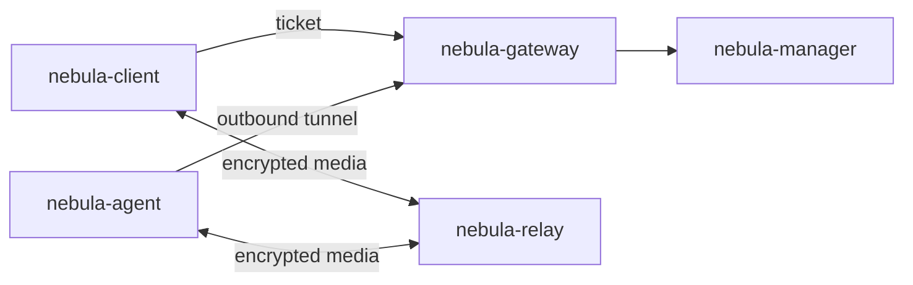

# NebulaDesk

Remote desktop over QUIC, end to end encrypted, for the current releases of
macOS, Windows and Linux.

A user signs in, sees the machines and applications they are entitled to, and
launches one. They are never told which machine serves it, and no part of the
infrastructure they pass through can read the pixels, the audio or the
keystrokes.

## The five programs

| Program | What it is |
| --- | --- |
| `nebula-manager` | The control plane. Users, tenants, machines, published resources, entitlements, and the short-lived tickets that authorise a session. Holds all the state; carries none of the media. |
| `nebula-gateway` | The only public entry point. Redeems tickets, and holds the outbound control tunnel each machine keeps open. |
| `nebula-relay` | The data plane. Forwards bytes between two QUIC connections without being able to read them. |
| `nebula-agent` | Runs on a machine that is being made available. Captures, encodes, injects input. |
| `nebula-client` | The workspace app a user runs. |



Three decisions shape everything else:

**The agent dials out.** A machine on a desk behind a home router is reachable
because it holds a connection to a gateway, not because someone forwarded a
port to it.

**One QUIC connection, many streams.** Video, audio, input and control share a
path without blocking each other, and a frame that is already too late is
cancelled rather than delivered.

**Noise IK between the endpoints.** The client encrypts to the machine's static
key. A gateway or relay that is fully compromised can drop a session but cannot
read or forge one.

The protocol and the reasoning behind it are in
[`docs/architecture/NEBULA_V2.md`](docs/architecture/NEBULA_V2.md).

## Building

Rust 1.89 or newer.

Windows needs the MSVC C++ tools and Windows SDK. Linux also needs native
GStreamer/PipeWire development libraries. Platform-specific build packages,
GPU requirements and permission setup are documented in
[Windows media](docs/windows-media.md) and [Linux media](docs/linux-media.md).

```sh
cargo build --workspace
```

Tests that exercise the manager need PostgreSQL 16 or newer:

```sh
createdb nebula_manager_test
NEBULA_TEST_DATABASE_URL="postgres:///nebula_manager_test" cargo test --workspace
```

Native agent and client builds are checked on Linux, Windows and macOS in CI.
That does not establish that a runner has a supported GPU, an interactive
desktop, or permission to capture it. Hardware media tests are ignored by
default; run them inside the desktop session on each target machine:

```sh
cargo test -p nebula-client --test media -- --ignored
```

The media probe uses the same native capture and decoder factories as a real
session. It requires hardware H.264 encoding and decoding, and any desktop
permission prompts must be accepted locally.

## Running a deployment locally

One script brings up the manager, relay and gateway, creates a tenant, and
prints the commands for everything else:

```sh
scripts/dev-stack.sh          # stop it again with: scripts/dev-stack.sh stop
```

It binds to loopback by default. To let a second machine reach it, give it
this machine's address on the network:

```sh
NEBULA_HOST=192.168.1.20 scripts/dev-stack.sh
```

Then, on the machine being shared:

```sh
# The token comes from an administrator; the script prints how to mint one.
nebula-agent enroll --manager-url http://192.168.1.20:8080 \
    --token "$TOKEN" --name studio-mac --state ~/.nebula-agent
nebula-agent run --state ~/.nebula-agent
```

Publish its desktop and grant yourself access:

```sh
scripts/publish-desktop.sh studio-mac
```

And connect. A user names a resource, never a machine:

```sh
export NEBULA_PASSWORD='correct horse battery staple'
nebula-client --manager-url http://192.168.1.20:8080 \
    --tenant acme --email me@acme.test list
nebula-client --manager-url http://192.168.1.20:8080 \
    --tenant acme --email me@acme.test connect "studio-mac Desktop"
```

<details>
<summary>Starting the services by hand</summary>

```sh
# Control plane. Migrations run at startup.
NEBULA_DATABASE_URL="postgres:///nebula" \
NEBULA_ACCESS_TOKEN_SECRET="$(openssl rand -hex 32)" \
NEBULA_BOOTSTRAP_TOKEN="$(openssl rand -hex 32)" \
NEBULA_LISTEN=0.0.0.0:8080 \
  nebula-manager

# One pairing secret, shared by every gateway and relay.
export NEBULA_PAIR_SECRET="$(nebula-relay gen-secret)"

# Data plane and edge. Each registers itself with the bootstrap token, after
# binding: the manager has to be told the address and certificate pin the
# process actually ended up with.
nebula-relay   --listen 0.0.0.0:7444 --advertise "$HOST:7444" \
    --manager-url http://localhost:8080 --bootstrap-secret "$BOOTSTRAP"
nebula-gateway --listen 0.0.0.0:7443 --advertise "$HOST:7443" \
    --manager-url http://localhost:8080 --bootstrap-secret "$BOOTSTRAP"
```

`--advertise` is what peers are told to dial. It has to be an address they can
reach, which is rarely the one the process bound to.

</details>

### macOS permissions

A machine running the agent needs two grants in System Settings > Privacy &
Security, both under the agent's own binary:

* **Screen & System Audio Recording** — without it there is nothing to capture,
  and the session fails rather than showing a blank picture.
* **Accessibility** — without it the agent refuses to offer input at all,
  rather than posting events the window server silently discards.

Both are tied to the exact binary, so a rebuild invalidates them. If the agent
is already listed and still refuses, remove the entry and add it again.

Audio starts independently of video and input. A slow or failed system mixer
must not delay the first picture or session cancellation. Recording permission
alone does not guarantee audio capture: ScreenCaptureKit can report `-3818`
(`Stream failed to start audio`) even with permission granted and a default
output device present. Such a session continues without sound and logs the
underlying error; reconnect after resolving the host's audio issue.

To check a machine before enrolling it, one probe per permission. Each prints
what to do when it fails:

```sh
cargo run -p nebula-agent --example capture_probe   # Screen Recording
cargo run -p nebula-agent --example input_probe     # Accessibility
```

`capture_probe` prints up to 30 captured frames. An idle screen may stop
producing updates, but a changing screen should keep producing frames. No
first frame, or a capture pipeline that closes early, is reported as an error.

## Status

Working end to end: the control plane, the relay, the gateway, an agent that
captures and encodes a real screen in hardware, plays out system audio and
injects input, and the client that signs a user in, connects, decodes, draws
and plays. The clipboard synchronises both ways, and a file dropped onto the
client window lands on the remote machine. Every one of those paths has a test
that drives it through a real gateway, a real relay and a real handshake.

The macOS path has been exercised between two Apple Silicon machines through
a remote gateway and relay, including user-confirmed keyboard and mouse
control. Sustained performance and recovery under congestion remain work in
progress; a clean still frame is not evidence of stable interactive streaming.

Native Windows and Linux agent/client backends are now wired into the platform
factories, with no synthetic media or software-codec fallback on those targets:

| Platform | Capture and hardware video | System audio and input |
| --- | --- | --- |
| Windows 11 | WGC / D3D11, Media Foundation encoder and D3D11VA decoder | WASAPI loopback, SendInput |
| Linux Wayland | Portal / PipeWire, GStreamer VA-API encoder and decoder | PipeWire output monitor, RemoteDesktop portal |

These implementations still need real Windows/Linux desktop and GPU runs before
runtime interoperability can be claimed. Linux requires a suitable compositor
portal and VA-API driver; Windows requires an interactive session and suitable
hardware MFTs. Neither supports secure login desktops or provisions virtual
displays. The current decoded-frame/renderer boundary copies CPU planes rather
than providing end-to-end GPU zero-copy.

`legacy/` holds the previous macOS-only implementation, kept for reference
while the platform backends are ported.
