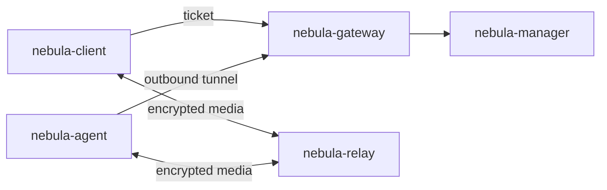

# NebulaDesk

Remote desktop over QUIC, end to end encrypted, for the current releases of
macOS, Windows and Linux.

A user signs in, sees the machines and applications they are entitled to, and
launches one. They are never told which machine serves it, and no part of the
infrastructure they pass through can read the pixels, the audio or the
keystrokes.

## The five programs

| Program | What it is |
| --- | --- |
| `nebula-manager` | The control plane. Users, tenants, machines, published resources, entitlements, and the short-lived tickets that authorise a session. Holds all the state; carries none of the media. |
| `nebula-gateway` | The only public entry point. Redeems tickets, and holds the outbound control tunnel each machine keeps open. |
| `nebula-relay` | The data plane. Forwards bytes between two QUIC connections without being able to read them. |
| `nebula-agent` | Runs on a machine that is being made available. Captures, encodes, injects input. |
| `nebula-client` | The workspace app a user runs. |



Three decisions shape everything else:

**The agent dials out.** A machine on a desk behind a home router is reachable
because it holds a connection to a gateway, not because someone forwarded a
port to it.

**One QUIC connection, many streams.** Video, audio, input and control share a
path without blocking each other, and a frame that is already too late is
cancelled rather than delivered.

**Noise IK between the endpoints.** The client encrypts to the machine's static
key. A gateway or relay that is fully compromised can drop a session but cannot
read or forge one.

The protocol and the reasoning behind it are in
[`docs/architecture/NEBULA_V2.md`](docs/architecture/NEBULA_V2.md).

## Building

Rust 1.89 or newer.

```sh
cargo build --workspace
```

Tests that exercise the manager need PostgreSQL 16 or newer:

```sh
createdb nebula_manager_test
NEBULA_TEST_DATABASE_URL="postgres:///nebula_manager_test" cargo test --workspace
```

Tests that need a real display are ignored by default, because a build machine
has neither a screen nor permission to record one. On a Mac with both:

```sh
cargo test -p nebula-client --test media -- --ignored
```

## Running a deployment locally

```sh
# 1. Control plane. Migrations run at startup.
DATABASE_URL="postgres:///nebula" \
NEBULA_BOOTSTRAP_SECRET="$(openssl rand -hex 32)" \
  cargo run -p nebula-manager

# 2. One pairing secret, shared by every gateway and relay.
export NEBULA_PAIR_SECRET="$(cargo run -q -p nebula-relay -- gen-secret)"

# 3. Data plane and edge. Both register themselves on first start.
cargo run -p nebula-relay   -- --listen 0.0.0.0:7444 --manager-url http://localhost:8080
cargo run -p nebula-gateway -- --listen 0.0.0.0:7443 --manager-url http://localhost:8080

# 4. A machine. The token comes from an administrator.
cargo run -p nebula-agent -- enroll --manager-url http://localhost:8080 \
    --token "$TOKEN" --name "studio-mac"
cargo run -p nebula-agent -- run

# 5. A user connects. They name a resource, never a machine.
cargo run -p nebula-client -- --manager-url http://localhost:8080 \
    --tenant acme --email someone@acme.test list
cargo run -p nebula-client -- --manager-url http://localhost:8080 \
    --tenant acme --email someone@acme.test connect "studio-mac"
```

### macOS permissions

A machine running the agent needs two grants in System Settings > Privacy &
Security, both under the agent's own binary:

* **Screen & System Audio Recording** — without it there is nothing to capture,
  and the session fails rather than showing a blank picture.
* **Accessibility** — without it keyboard and mouse events are discarded.

Both are tied to the exact binary, so a rebuild invalidates them. If the agent
is already listed and still refuses, remove the entry and add it again.

To check a machine before enrolling it:

```sh
cargo run -p nebula-agent --example capture_probe
```

## Status

Working end to end: the control plane, the relay, the gateway, an agent that
captures and encodes a real screen in hardware and injects input, and the
client that signs a user in, connects, decodes and draws.

macOS is the platform that is finished. Windows and Linux build and run
everything except capture, encode and injection, which fall back to a test
pattern and a discard sink; their backends are next. Audio, clipboard and file
transfer are specified but not implemented.

`legacy/` holds the previous macOS-only implementation, kept for reference
while the platform backends are ported.
