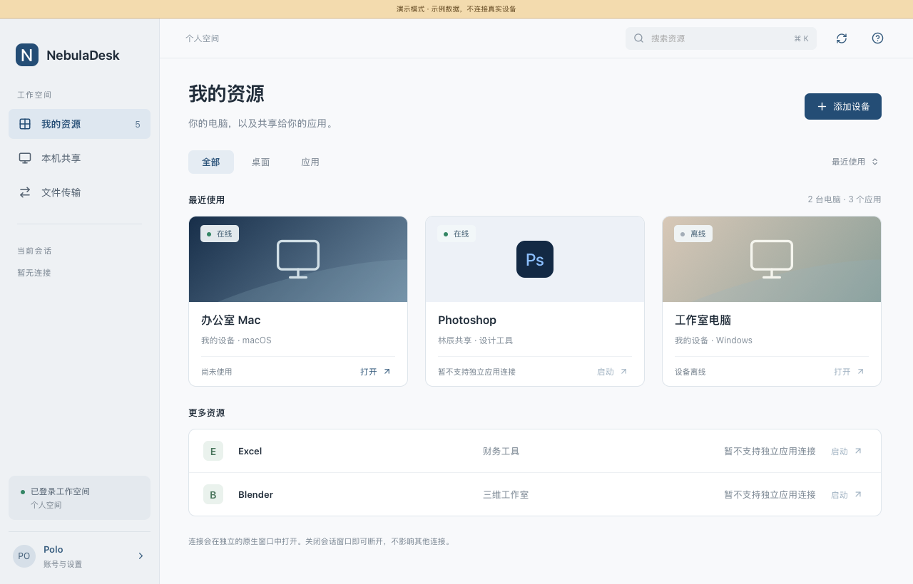
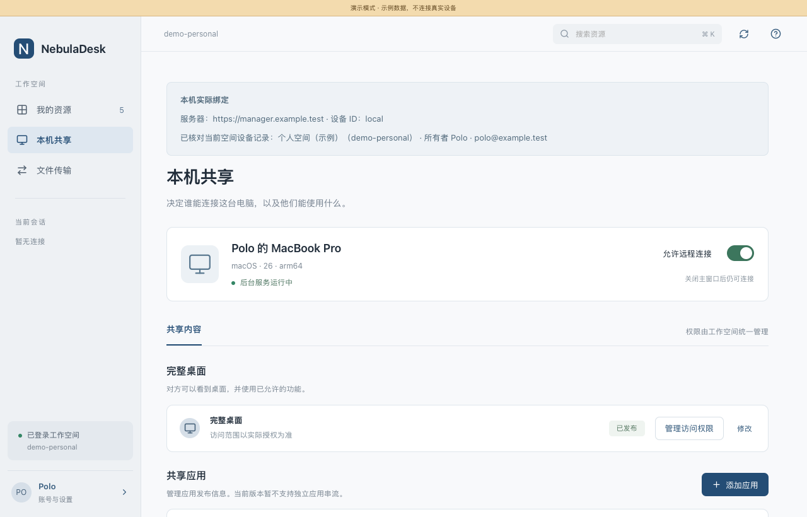
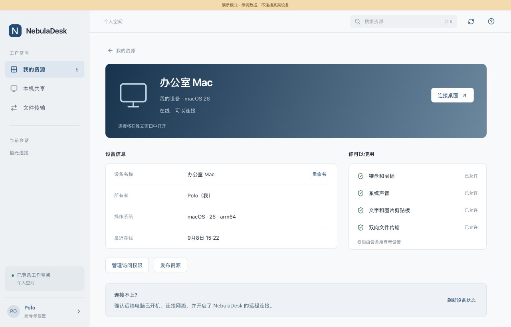
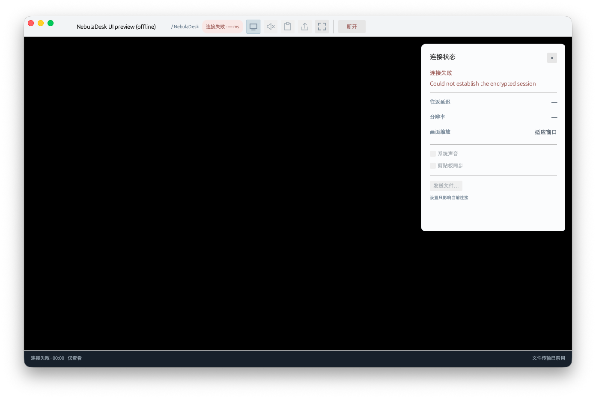
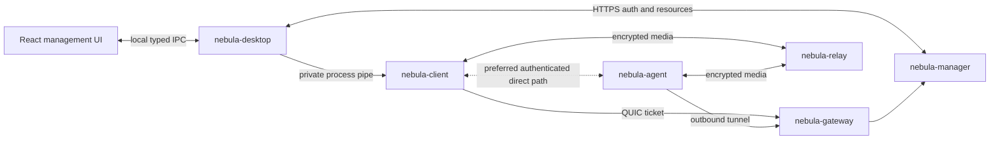

# NebulaDesk

Remote desktop over QUIC, end to end encrypted, for the current releases of
macOS, Windows and Linux.

A user signs in and sees the desktops and published applications they are
entitled to. Desktop sessions use a native window; application publication and
authorization are separate from single-application streaming, which is not yet
available. The gateway and relay cannot read session pixels, audio or keystrokes.

## 当前产品界面

**管理主窗口负责资源和共享，独立 Session 窗口负责远程操作**，不是在管理页面里嵌入一块视频。

| 界面 | 使用效果 |
| --- | --- |
| 我的资源 | 登录后看到自己的电脑和获得授权的应用；搜索、筛选、查看在线状态，已打开的连接可直接返回。 |
| 本机共享 | 注册当前电脑、启停被控服务、查看系统权限，分别管理桌面和应用的访问授权。 |
| 设备详情 | 查看设备信息、在线状态和允许使用的功能；所有者可以修改名称或移除设备。 |
| Session | 远程画面占据主区域，工具条提供声音、剪贴板、文件、全屏和断开操作；连接面板显示实际路径和测量数据。 |

以下展示最新 UI，管理页面使用演示数据。

### 我的资源

桌面与应用分开呈现，离线设备和暂不支持的单应用连接明确禁用。



### 本机共享

管理当前电脑的后台共享、桌面授权和应用发布配置；发布配置不代表已支持单应用串流。



### 设备详情

集中展示设备信息、连接入口、所有者操作和获准使用的功能。



### 独立原生 Session

工具条和连接面板直接渲染在原生窗口中，下图展示离线时的连接失败状态。



更多界面素材见[产品 UI 目录](design/product-ui/README.md)。

### 界面与运行边界

前后端分开维护：`apps/desktop-ui` 使用 React/TypeScript，只负责管理界面；
`crates/nebula-desktop` 使用 Rust/Tauri，负责登录、API 和本机进程；
`crates/nebula-client` 保留原生会话、QUIC、解码和渲染。
**音视频不经过 WebView、JavaScript 或桌面管理 IPC。**

关闭一个 Session 只结束该连接；关闭管理窗口与停止本机共享是不同操作。
应用卡片的目标是直接启动获得授权的软件，不要求使用者寻找承载它的电脑。
当前尚未实现单应用窗口串流，相关入口必须明确标为不可连接，不能退化为暴露整台电脑。
公网持续画面流畅度优化也仍是独立工作，不因产品界面落地而视为解决。

工程分层、服务器部署及完整连接顺序见
[产品工程与运行时架构](docs/architecture/PRODUCT_ARCHITECTURE.md)；
前后端调用边界见[桌面接口约定](docs/architecture/DESKTOP_CONTRACT.md)。

## Programs and responsibilities

| Program | What it is |
| --- | --- |
| `nebula-manager` | The control plane. Users, tenants, machines, published resources, entitlements, and the short-lived tickets that authorise a session. Holds all the state; carries none of the media. |
| `nebula-gateway` | The public QUIC signalling entry point. Redeems tickets, and holds the outbound control tunnel each machine keeps open. |
| `nebula-relay` | The data plane. Forwards bytes between two QUIC connections without being able to read them. |
| `nebula-agent` | Runs on a machine that is being made available. Captures, encodes, injects input. |
| `nebula-desktop` | The management application. Hosts the frontend, calls Manager APIs, and supervises native session windows. |
| `nebula-client` | A native session window and CLI client; owns the QUIC/media path, not the management WebView. |



Four decisions shape everything else:

**The agent dials out.** A machine on a desk behind a home router is reachable
because it holds a connection to a gateway, not because someone forwarded a
port to it.

**One logical session, many QUIC streams.** Video, audio, input and control share a
path without blocking each other, and a frame that is already too late is
cancelled rather than delivered.

**Noise IK between the endpoints.** The client encrypts to the machine's static
key. A gateway or relay that is fully compromised can drop a session but cannot
read or forge one.

**Prefer a proven faster direct path; keep a relay fallback.** After gateway
authorisation and the initial encrypted relay handshake, compatible peers
exchange bounded local-interface candidates and probe a separately authenticated
direct QUIC connection. The session selects direct only when its measured path
RTT is better. The relay stays warm, carrying small liveness probes rather than
duplicated media, so a failed direct path can fall back without reopening the
resource or restarting capture. The client title shows the actual `Relay` or
`Direct` route. Gateway signalling remains connected for session lifetime and
endpoint control; it is not part of the media path.

Direct negotiation currently covers reachable IPv4 and unscoped IPv6 host
addresses, not STUN/NAT hole punching. Blocked or slower candidates leave the
relay session running. Older peers retain the single-relay protocol.

Revoking a grant, disabling a resource or removing a device prevents new
Manager-authorized session requests. It does not immediately recall a previously
issued ticket or force an established session to close. Stop sharing on the
controlled machine when an immediate cutoff is required; live authorization
revocation still needs a Manager-to-Gateway enforcement path.

For a controlled routing check against an authorised resource, the headless
probe can close just its direct connection and require a relay round trip and
post-switch keyframe without opening another logical session:

```sh
# NEBULA_PASSWORD supplies the account password; use an exact resource UUID.
cargo run --release -p nebula-client --example path_probe -- \
  --manager-url "$NEBULA_MANAGER_URL" --tenant "$NEBULA_TENANT" \
  --email "$NEBULA_EMAIL" --resource-id "$RESOURCE_ID" \
  --seconds 60 --disconnect-direct-after 15
```

The probe reports authenticated received records and per-path transport
counters. It does not decode video or establish physical presentation latency.

The protocol and the reasoning behind it are in
[`docs/architecture/NEBULA_V2.md`](docs/architecture/NEBULA_V2.md).

## Building

Rust 1.89 or newer.

Windows needs the MSVC C++ tools and Windows SDK. Linux also needs native
GStreamer/PipeWire development libraries. Platform-specific build packages,
GPU requirements and permission setup are documented in
[Windows media](docs/windows-media.md) and [Linux media](docs/linux-media.md).

```sh
cargo build --workspace
```

The management WebView is an opt-in build (`nebula-desktop --features gui`);
server-only builds do not need Node or WebKit. Its frontend is built separately:

```sh
npm --prefix apps/desktop-ui ci
npm --prefix apps/desktop-ui run build
node scripts/desktop-sidecars.mjs --debug
cargo build -p nebula-desktop --features gui
```

The GUI build also needs the native session and Agent executables as sidecars.
Linux additionally needs WebKitGTK 4.1, Ayatana AppIndicator and librsvg
development packages; Windows uses WebView2, and macOS uses the system WebKit.
GUI bundling does not replace the native media prerequisites below.

To build a self-contained macOS application for local use:

```sh
npm --prefix apps/desktop-host ci
npm --prefix apps/desktop-host run build -- --debug --bundles app
# target/debug/bundle/macos/NebulaDesk.app
```

Run the sidecar preparation above first. For a release bundle, prepare sidecars
without `--debug` and build without `--debug`; signing and notarization still
need the distributor's credentials. The installed bundle does not need Node
or a running Vite server. Windows/Linux use their native Tauri bundle targets;
see the [desktop host guide](crates/nebula-desktop/README.md).

For the standalone management preview:

```sh
npm --prefix apps/desktop-ui run dev
# Open http://127.0.0.1:1420/?demo=1 (labelled sample data, no real sessions).
```

The native window can also be inspected without connecting to a machine:
`cargo run -p nebula-client --example session_preview`. It deliberately shows
the disconnected/error state, not a simulated remote desktop.

Tests that exercise the manager need PostgreSQL 16 or newer:

```sh
createdb nebula_manager_test
NEBULA_TEST_DATABASE_URL="postgres:///nebula_manager_test" cargo test --workspace
```

Native agent and client builds are checked on Linux, Windows and macOS in CI.
That does not establish that a runner has a supported GPU, an interactive
desktop, or permission to capture it. Hardware media tests are ignored by
default; run them inside the desktop session on each target machine:

```sh
cargo test -p nebula-client --test media -- --ignored
```

The media probe uses the same native capture and decoder factories as a real
session. It requires hardware H.264 encoding and decoding, and any desktop
permission prompts must be accepted locally.

## Running a deployment locally

One script brings up the manager, relay and gateway, creates a tenant, and
prints the commands for everything else:

```sh
scripts/dev-stack.sh          # stop it again with: scripts/dev-stack.sh stop
```

For a fresh stack using desktop self-enrollment, set
`NEBULA_REGION=default scripts/dev-stack.sh`. Self-enrollment uses the
operator-controlled `default` region; it cannot select another region.
The scripts retain `local` as their default for existing CLI deployments.
Use the same region when restarting an existing deployment.

It binds to loopback by default. To let a second machine reach it, give it
this machine's address on the network:

```sh
NEBULA_HOST=192.168.1.20 scripts/dev-stack.sh
```

Then, on the machine being shared:

```sh
# The token comes from an administrator; the script prints how to mint one.
nebula-agent enroll --manager-url http://192.168.1.20:8080 \
    --token "$TOKEN" --name studio-mac --state ~/.nebula-agent
nebula-agent run --state ~/.nebula-agent
```

Publish its desktop and grant yourself access:

```sh
scripts/publish-desktop.sh studio-mac
```

And connect. A user names a resource, never a machine:

```sh
export NEBULA_PASSWORD='correct horse battery staple'
nebula-client --manager-url http://192.168.1.20:8080 \
    --tenant acme --email me@acme.test list
nebula-client --manager-url http://192.168.1.20:8080 \
    --tenant acme --email me@acme.test connect "studio-mac Desktop"
```

<details>
<summary>Starting the services by hand</summary>

```sh
# Control plane. Migrations run at startup.
NEBULA_DATABASE_URL="postgres:///nebula" \
NEBULA_ACCESS_TOKEN_SECRET="$(openssl rand -hex 32)" \
NEBULA_BOOTSTRAP_TOKEN="$(openssl rand -hex 32)" \
NEBULA_LISTEN=0.0.0.0:8080 \
  nebula-manager

# One pairing secret, shared by every gateway and relay.
export NEBULA_PAIR_SECRET="$(nebula-relay gen-secret)"

# Data plane and edge. Each registers itself with the bootstrap token, after
# binding: the manager has to be told the address and certificate pin the
# process actually ended up with.
nebula-relay   --listen 0.0.0.0:7444 --advertise "$HOST:7444" \
    --manager-url http://localhost:8080 --bootstrap-secret "$BOOTSTRAP"
nebula-gateway --listen 0.0.0.0:7443 --advertise "$HOST:7443" \
    --manager-url http://localhost:8080 --bootstrap-secret "$BOOTSTRAP"
```

`--advertise` is what peers are told to dial. It has to be an address they can
reach, which is rarely the one the process bound to.

</details>

### macOS permissions

A machine running the agent needs two grants in System Settings > Privacy &
Security, both under the agent's own binary:

* **Screen & System Audio Recording** — without it there is nothing to capture,
  and the session fails rather than showing a blank picture.
* **Accessibility** — without it the agent refuses to offer input at all,
  rather than posting events the window server silently discards.

Both are tied to the exact binary, so a rebuild invalidates them. If the agent
is already listed and still refuses, remove the entry and add it again.

Direct connections also need **Local Network** access on both Macs. A CLI
launched by an IDE or terminal may inherit that application's privacy identity.
Successful system `ssh`/`nc` traffic does not prove that Nebula has the same
permission. If macOS reports `Local network prohibited`, allow the responsible
application under Privacy & Security > Local Network and relaunch it if needed,
or launch the CLI from Terminal and grant Terminal access. Do not disable the
firewall or change network routes to work around a privacy denial.

Audio starts independently of video and input. A slow or failed system mixer
must not delay the first picture or session cancellation. Recording permission
alone does not guarantee audio capture: ScreenCaptureKit can report `-3818`
(`Stream failed to start audio`) even with permission granted and a default
output device present. Such a session continues without sound and logs the
underlying error; reconnect after resolving the host's audio issue.

To check a machine before enrolling it, one probe per permission. Each prints
what to do when it fails:

```sh
cargo run -p nebula-agent --example capture_probe   # Screen Recording
cargo run -p nebula-agent --example input_probe     # Accessibility
```

`capture_probe` prints up to 30 captured frames. An idle screen may stop
producing updates, but a changing screen should keep producing frames. No
first frame, or a capture pipeline that closes early, is reported as an error.

## Status

Working end to end: the control plane, the relay, the gateway, an agent that
captures and encodes a real screen in hardware, plays out system audio and
injects input, and the client that signs a user in, connects, decodes, draws
and plays. Clipboard text/images and client-window file drops have protocol
and session integration coverage through the gateway, relay and handshake.
Two-Mac desktop runs have also exercised native text/PNG pasteboards in both
directions, with endpoint logs confirming Nebula clipboard messages, and
six-file batches in each direction (including empty and 5 MiB files) verified
by content hashes. Copying a file again preserves the earlier arrival.

### Clipboard and files on macOS

With a connected session, copy text or an image on either Mac to synchronize
it when the `clipboard` policy permits. Both native PNG-only and TIFF image
representations are supported. Content already copied before connection is
not sent.

To send files **in either direction**, select regular files in Finder on the
source Mac and choose **Copy** (Command-C) after connection. Native
`public.file-url` items feed the file-transfer worker; this uses the independent
`file_transfer` policy and also works when text/image clipboard sync is disabled.
A copied filename is not downgraded to clipboard text when file transfer is
disabled. Client-window file drops remain available for client-to-agent sends.

Files arrive automatically in `~/Downloads/NebulaDesk` on the receiving machine,
or its `NEBULA_DOWNLOADS` override; there is no remote Finder Paste step. File
arrivals do not replace the receiving clipboard or trigger a return transfer.
Copying the same file again starts another transfer and keeps existing arrivals
under numbered names. Directories, symlinks and nonlocal file URLs are refused;
there is no directory traversal or remote path-read command. Empty files and
multi-file copies are supported, with four active sends, a bounded pending queue,
an 8 GiB per-file limit and BLAKE3 verification before finalization.
Read/write, format, hash and queue failures are reported in the endpoint logs.
On macOS, finalization uses an atomic no-replace rename, including for
case-equivalent names. Other platforms currently require hard-link support in
the download filesystem. Transfers stalled for 120 seconds release their slots.

### macOS input and audio

Desktop runs have exercised physical typing, Command-A selection, clicks,
double/triple clicks, right clicks, dragging and scrolling through the graphical
client. Held input is released on client focus loss or disconnect. Keys use the
remote keyboard layout; client-side IME composition/commit forwarding is not
implemented.

System audio has been verified from a generated tone on the remote Mac through
ScreenCaptureKit, Opus and the live session to the client's native audio output,
with a silent baseline. This is not a measurement of physical speaker audibility.
An earlier host-level audio startup failure also affected standalone native
playback; it stopped reproducing without an audio-service reset. If it recurs,
`cargo run -p nebula-agent --example audio_probe` provides a bounded
capture/Opus diagnostic with a generated tone, rather than treating silent
callbacks as successful capture. Run it from the authorized desktop application
(for example Terminal); SSH and GUI launches can have different macOS permissions.

The macOS path has been exercised between two Apple Silicon machines through
a remote gateway and relay, including user-confirmed keyboard and mouse
control. Sustained performance and recovery under congestion remain work in
progress; a clean still frame is not evidence of stable interactive streaming.

Native Windows and Linux agent/client backends are now wired into the platform
factories, with no synthetic media or software-codec fallback on those targets:

| Platform | Capture and hardware video | System audio and input |
| --- | --- | --- |
| Windows 11 | WGC / D3D11, Media Foundation encoder and D3D11VA decoder | WASAPI loopback, SendInput |
| Linux Wayland | Portal / PipeWire, GStreamer VA-API encoder and decoder | PipeWire output monitor, RemoteDesktop portal |

These implementations still need real Windows/Linux desktop and GPU runs before
runtime interoperability can be claimed. Linux requires a suitable compositor
portal and VA-API driver; Windows requires an interactive session and suitable
hardware MFTs. Neither supports secure login desktops or provisions virtual
displays. The current decoded-frame/renderer boundary copies CPU planes rather
than providing end-to-end GPU zero-copy.

`legacy/` holds the previous macOS-only implementation, kept for reference
while the platform backends are ported.
