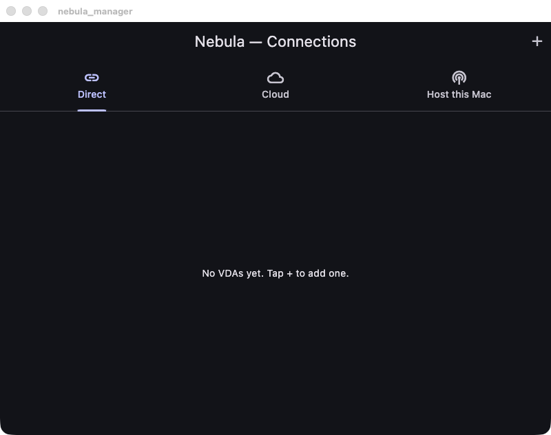

# Nebula — 使用指南 (Usage)

macOS-only 远程桌面:Mac VDA(被控)→ Mac CWA(查看),QUIC 传输,支持中继兜底
+ 自动升级直连,以及独立高刷 session 进程 + Flutter 管理器。此外还有一条完全
独立的可选路径:浏览器通过标准 WebRTC 直接观看/操控,无需安装原生客户端
(见下文"浏览器直接观看")。

## 构建

```sh
# 原生目标(VDA / session / relay)
cmake -S . -B build -G Ninja -DCMAKE_BUILD_TYPE=Release
cmake --build build

# 一键构建并打包成单一 .app(内嵌 session helper)
./scripts/package_app.sh
```

依赖:Xcode 工具链、macOS 26+、Flutter、
`brew install libmsquic libsodium opus libjuice srtp libusrsctp nlohmann-json plog`、
系统自带 `libcurl`。libdatachannel(WebRTC 支持,MPL 2.0)由顶层 CMake 用
`FetchContent` 自动拉取和构建,不需要单独安装。

## 三种运行方式

### 1. 直连(同一局域网,最简单)

被控端(共享屏幕的 Mac,需授予「屏幕录制」+「辅助功能」权限):
```sh
./build/app/vda/nebula_vda --port 7000
```
查看端:
```sh
./build/app/session/nebula_session --host <VDA局域网IP> --port 7000
```

### 2. 经中继(穿内网 / 跨网络,自动升级直连)

先在一台有公网 IP 的机器(或任意可达主机)起中继。
**生产部署见 [server/nebula_relay/DEPLOY.md](server/nebula_relay/DEPLOY.md)**(Docker / systemd / 手动)。
本地快速起一个:
```sh
./build/server/nebula_relay/nebula_relay --port 7100
```
被控端(主动连中继并注册 device-id):
```sh
./build/app/vda/nebula_vda --port 7000 \
    --relay <中继IP> --relay-port 7100 --device mymac --token secret123
```
查看端(凭 device-id + token 配对):
```sh
NEBULA_PSK=<共享密钥> ./build/app/session/nebula_session \
    --relay <中继IP> --relay-port 7100 --device mymac --token secret123
```
流程:先经中继出画面 → 后台在 relay 的配对回复里免费拿到对端观测公网地址,
同时交换局域网候选,VDA 再向 CWA 观测地址发几个 UDP 打洞包 →
直连探测成功后**媒体自动切到直连**,中继转为兜底。日志可见 `media path is now DIRECT`。
若直连中途掉线,会**自动回退到中继**并在后台重试升级,不中断会话
(见 ARCHITECTURE.md §10 和 NAT_TRAVERSAL.md 关于 NAT 穿透覆盖范围的说明)。

VDA 进程保持在中继上注册,可以反复被同一个或不同的 CWA 连接,无需重启;
新查看端接入会顶替当前查看端(旧连接收到 `Superseded` 后断开)。
CWA 断线重连(同一 `nebula_session` 再次运行,或短暂网络抖动)会优先用
上一次会话缓存的重连 ticket(存放于 `~/Library/Application Support/Nebula/relay_tickets.txt`),
免去重新出示共享 token。若 VDA 一侧掉线,中继会保留在等待中的 CWA 连接
30 秒宽限期,VDA 在此期间重新注册即可无感恢复,不需要 CWA 重新握手。

### 3. Flutter 管理器(图形界面)

```sh
open "app/manager/build/macos/Build/Products/Debug/nebula_manager.app"
```

界面有三个 tab:



- **Direct**:在界面里「+」手动添加 VDA(名称 / host / port / 可选中继 / 密钥),点 **Connect**。
- **Cloud**:登录一个 `server/nebula_cloud` 账号,自动列出该账号能访问的全部设备
  (自己拥有的 + 别人分享给你的 + 所在 Group 里的 + admin 能看到全部),点 **Connect**
  即可——中继地址、短期会话票据、应用层加密密钥(PSK)全部由 `nebula_cloud` 自动下发,
  不需要手动填任何连接参数。详见 [server/nebula_cloud/README.md](server/nebula_cloud/README.md)
  的「Groups & admin role」「PSK distribution」两节。
- **Host this Mac**(新增):跟 Cloud tab 用同一个登录账号——把这台 Mac 自己注册成一台
  VDA。填设备名 + 入网密钥(`DEVICE_ENROLLMENT_TOKEN`,管理员配置的共享密钥)点
  **Register & Start Hosting**,就会调用 `POST /devices/self-register` 拿到长期凭证并
  本地持久化,然后在同一个 app 里拉起并托管 `nebula_vda` 子进程(跟 Direct/Cloud tab 托管
  `nebula_session` 是同一套机制,状态也走同样的 `NEBULA_STATUS:` 协议)。也就是同一台电脑、
  同一个 app,既能当 CWA 查看别的设备,也能把自己注册成 VDA 被别人连——详见
  [server/nebula_cloud/README.md](server/nebula_cloud/README.md) 的「Self-registration &
  trial credit」一节。

虚拟显示器是捕获的必需条件。CWA 会在 HELLO 中发送本机主屏幕的逻辑尺寸,
VDA 必须创建并捕获一个完全匹配该尺寸的虚拟显示器;创建失败时会报错且不会
回退到物理显示器。
> 虚拟显示器基于 macOS 私有 API(与 BetterDisplay / Luna Display 同款),
> 适合无头 / 远程的 Mac mini。

### 4. SaaS 控制面(账号 + 授权分享 + Web 控制台,可选)

参照 [crossdesk](https://github.com/kunkundi/crossdesk) 的 Remote-ID + 账号模式,
`server/nebula_cloud/` 提供一个独立的 Node.js/TypeScript + PostgreSQL 服务,
在 `nebula_relay` 的 device-id+token 配对协议之上加了一层账号体系:注册/登录、
设备归属、按邮箱分享授权、短期会话票据签发(60s 有效期的 JWT)、连接审计,
以及一个能跑起来的最小 Web 控制台。此外还有 **Group + admin 角色**:
`INITIAL_ADMIN_EMAILS` 引导出第一个 admin,admin 能看到/连接所有设备,
并把设备分组后批量授权给一批用户,不用逐台设备加分享。

还有 **自助注册 + 试用额度**:配置 `DEVICE_ENROLLMENT_TOKEN`(共享入网密钥)后,
任何已登录用户都能直接 `POST /devices/self-register` 把设备注册到自己账号下,不需要
admin 先手动建设备/发 claim code(见上面 Flutter「Host this Mac」tab)。新账号默认送
`DEFAULT_TRIAL_CREDIT_SECONDS`(默认 600 秒 = 10 分钟)的连接额度,每次 `/connect`
成功扣一次 `CONNECT_CREDIT_COST_SECONDS`(固定扣费,不按实际连接时长计费),额度不够
会返回 402,admin 可以用 `PATCH /admin/users/:id/credit` 充值(admin 自己不计费)。
详见 [server/nebula_cloud/README.md](server/nebula_cloud/README.md)。

启用方式:`nebula_relay` 追加 `--saas-auth-url <cloud>/internal/authorize --saas-auth-secret <同 RELAY_SHARED_SECRET>`
后,CWA 连接的授权判定会实时回调该服务(而不是本地静态 token 比较),
支持撤销授权、审计、按账号可见性等能力;VDA 的注册仍使用 SaaS 创建设备时
下发的长期 token,不受影响。追加 `--saas-heartbeat-url <cloud>/internal/heartbeat`
后,中继还会周期性上报已注册的 VDA,让 Web 控制台的在线状态在经典 QUIC 路径下也准确。

### 5. 浏览器直接观看(WebRTC,无需安装原生客户端)

参照 [crossdesk-web-client](https://github.com/kunkundi/crossdesk-web-client) 的产品形态——
真实浏览器只认标准 WebRTC(ICE/DTLS/SRTP),没有绕过这个协议的办法。
`nebula_vda` 新增了一条**完全独立于 QUIC 路径**的可选通路,基于
[libdatachannel](https://github.com/paullouisageneau/libdatachannel)(MPL 2.0,
不是 Google 的 libwebrtc,也没有照抄 crossdesk 的 GPL/LGPL 代码):

```sh
nebula_vda --port 7000 --h264 \
    --webrtc --webrtc-signaling-url ws://<nebula_cloud地址>:4000/ws/signaling \
    --device <relayDeviceId> --token <relayToken> \
    --webrtc-width 1920 --webrtc-height 1080 \
    --stun stun.l.google.com:19302 \
    --turn <turn服务器>:3478 <用户名> <密码>
```

`--device`/`--token`复用 SaaS 建设备时下发的同一套长期凭证。然后在 `nebula_cloud`
的 Web 控制台里登录、点设备的 **Connect**,会跳到 `/watch` 页面,用浏览器原生
`RTCPeerConnection` 直接和 VDA 建立媒体连接——`nebula_cloud` 只转发 SDP/ICE 这类
很小的 JSON 信令消息,不经手任何画面数据。鼠标键盘在 `<video>` 元素上采集后,
编码成与原生 `nebula_session` 完全相同的 24 字节 `NebulaInputEvent` 格式,通过
WebRTC DataChannel 传回 VDA 注入。

**这条路径天然支持多个浏览器观众同时并发观看同一台 VDA**(每个都有独立的
DTLS/SRTP 会话,不存在 QUIC 路径那种共享密钥不能多人同时用的限制,见
ARCHITECTURE.md §4a 和 ROADMAP.md §3 关于该限制的说明)。

对称型 NAT 需要部署标准 TURN 服务器(推荐 [coturn](https://github.com/coturn/coturn),
本项目不自己实现 TURN),否则会连不上;局域网或 cone/限制型 NAT 下原生路径的
relay 观测地址 + 打洞方案也够。

## 命令行参数

**nebula_vda**:`--port --psk --fps --bitrate --h264`
  中继模式追加:`--relay <host> --relay-port <p> --device <id> --token <t>`
  浏览器/WebRTC 模式追加:`--webrtc --webrtc-signaling-url <ws地址> --webrtc-width <W> --webrtc-height <H>`
  `--stun <host:port>`(可重复)`--turn <host:port> <user> <pass>`

**nebula_session**:`--host --port --title`
  中继模式追加:`--relay --relay-port --device --token`;密钥用环境变量 `NEBULA_PSK`
  (重连 ticket 由客户端自动缓存/带上,无需手动传参)

**nebula_relay**:`--port --cert <pem> --key <pem>`
  SaaS 模式追加:`--saas-auth-url <url> --saas-auth-secret <secret>`

## 注意

- 单机 loopback(127.0.0.1)在多网卡主机上 Network.framework 可能不绑回环,
  请用局域网 IP 或两台 Mac 测试(详见 ARCHITECTURE.md §9)。
- 自签证书(VDA 内嵌 / relay 的 certs/)仅供开发,生产需替换。
- 中继为盲转发,**且现在有真正的应用层端到端加密**(ChaCha20-Poly1305,
  会话密钥经 HKDF 由共享密钥 + 双方随机 salt 派生,握手在 KeyInit/KeyInitAck
  两个消息里完成)——中继只经手密文,详见 ARCHITECTURE.md §4a。
- NAT 穿透在两条路径上覆盖范围不同:QUIC 原生直连升级路径目前是 LAN 候选 +
  relay 免费下发的对端观测公网地址 + 轻量 UDP 打洞,对 cone/限制型 NAT 有效,对
  **对称型 NAT 无效**(仍会停留在中继上,如实记录,完整 ICE/TURN 方案见
  NAT_TRAVERSAL.md,暂未实现);**WebRTC/浏览器路径已经支持标准 TURN**
  (`--turn` 参数,配合自建的 coturn),因此能覆盖对称型 NAT——两条路径
  各自独立、互不影响,选哪条看你的场景。
- 跨平台(Windows/Linux)后端仍是待做项,本次未涉及,详见 ROADMAP.md。

