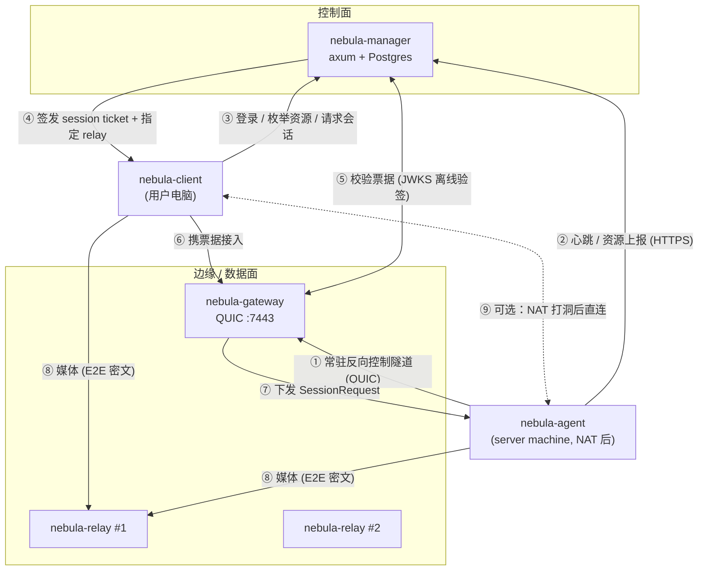

# NebulaDesk V2 — 架构设计（全面重构）

> 状态：设计定稿，实施中。
> 本文取代 `ARCHITECTURE.md` / `ARCHITECTURE_OVERVIEW.md` / `PLAN.md` / `ROADMAP.md`
> （V1 的 macOS-only C++/ObjC++ 实现将归档至 `legacy/`）。

---

## 0. 设计目标与硬约束

| 维度 | 决策 |
|------|------|
| 语言 | **Rust 全栈**，单一 cargo workspace，三平台同一套代码 |
| 传输 | **仅 QUIC**（`quinn` + `rustls`），不做 TCP 兼容 |
| 平台 | Windows 11 (22H2/24H2+)、macOS 26+、Linux（Ubuntu 24.04/26.04 或等价 glibc 2.39+） |
| 编解码 | **平台原生硬件 FFI**：VideoToolbox / Media Foundation+D3D11VA / VA-API+NVENC。无 GPL 依赖 |
| 渲染 | `wgpu`（Metal / D3D12 / Vulkan），零拷贝导入平台纹理 |
| 音频 | **Opus**（取代 V1 的 AAC），20ms 帧 + in-band FEC |
| 延迟目标 | 局域网 glass-to-glass < 30ms，公网中继 < 80ms |
| 多租户 | 用户 → 资源（机器/发布应用）授权模型，从第一天就在数据模型里 |

---

## 1. 组件拓扑（5 个可发布程序）

用户提出的「gateway / relay server / client / server machine」四部分，落到工程上拆成
**控制面（manager）+ 边缘面（gateway）+ 数据面（relay）+ 两个端点（agent / client）**。
Citrix 心智模型对照：

| NebulaDesk | Citrix 对应物 | 职责 |
|---|---|---|
| `nebula-manager` | DDC + StoreFront | 控制面：用户、设备、发布应用、授权、会话撮合、审计 |
| `nebula-gateway` | Citrix Gateway | 边缘面：唯一公网入口，票据鉴权、agent 反向隧道注册、撮合双方到 relay |
| `nebula-relay` | HDX 中继 | 数据面：纯字节转发（只见密文），可水平扩容、就近部署 |
| `nebula-agent` | VDA | 被控端：注册、采集/编码、输入注入、发布桌面与应用 |
| `nebula-client` | Workspace App | 控制端：登录、枚举资源、发起会话、解码渲染、输入采集 |

> 小规模部署可把 gateway 与 relay 编到同一进程（`nebula-gateway --embedded-relay`），
> 大规模时 gateway 保持轻量（只处理控制信令），relay 独立扩容承载带宽。



### 1.1 为什么 agent 用「常驻反向隧道」而不是 ICE

V1 依赖 relay 配对 + 尽力而为的直连升级，NAT 场景成功率不可控。V2 中
**agent 主动向 gateway 建立并保持一条 QUIC 控制连接**（出站，任何 NAT/防火墙都放行），
gateway 通过这条隧道下发 `SessionRequest`，agent 再主动出站连到 relay。
于是**永远不需要入站可达性**，连接成功率 100%；直连（打洞）只是可选的延迟优化。

---

## 2. NDP v3 —— 线路协议

ALPN：`ndp/3`（端点间）、`ndp-gw/3`（agent↔gateway 控制隧道）、`ndp-relay/3`（端点↔relay）。

### 2.1 QUIC 通道映射（单连接多流，取代 V1 的三条独立连接）

| 逻辑通道 | QUIC 载体 | 可靠性 | 理由 |
|---|---|---|---|
| Control | 1 条双向流（连接建立时打开） | 可靠有序 | 能力协商、分辨率变更、光标、统计、通道协商 |
| Video | **每帧一条单向流** | 可靠但可 `reset_stream` | 帧间零 HoL 阻塞；发送端可主动丢弃过期帧 |
| Audio | QUIC datagram | 不可靠 | 20ms Opus 帧 + FEC，宁丢不等 |
| Input | 1 条双向流 | 可靠有序 | 事件顺序敏感，量极小 |
| Clipboard | 按需双向流 | 可靠 | 文本/图片 |
| FileTransfer | 每次传输一条双向流 | 可靠 | 大文件不阻塞其它通道 |
| Stats/RTT | datagram | 不可靠 | 带宽估计探测 |

**每帧一条单向流**是 V2 的核心性能决策：一帧写完即 `finish()`，接收端按流边界天然完成分帧，
无需自定义长度前缀重组；网络拥塞时发送端对陈旧帧调 `reset_stream`，直接把带宽让给新帧。

### 2.1.1 流调度优先级（不做 socket 时分复用）

QUIC 单连接本身就是多路复用且无队头阻塞，所以**不需要自己在 socket 上做时分复用**。
缺的不是复用而是**调度策略**：quinn 默认在打开的流之间公平轮转，于是 150KB 的关键帧
和 20 字节的鼠标事件平分带宽，大的那个必然最后到达。

因此每条流在打开时声明一个 0–255 的紧急度，越大越先发：

| 通道 | 紧急度 | 理由 |
|---|---|---|
| Input | 40 | 延迟就是整个会话的手感，而消息只有几十字节 |
| Control | 30 | 承载修复其它一切的请求（如关键帧请求） |
| Video（关键帧） | 25 | 比相邻帧大一到两个数量级，公平调度必然最后到达 |
| Video（P 帧） | 20 | |
| Clipboard | 10 | 批量数据，可以等空隙 |
| FileTransfer | 0 | 同上，且绝不能饿死交互 |

Audio 不在表内：它走 datagram，QUIC 本来就把 datagram 排在流数据之前。

**紧急度必须明文放在流首部**（4 字节前缀：`u16 通道号 ‖ u8 紧急度 ‖ u8 保留`）。
因为 relay 拿不到密钥，看不见 `flags` 里的 keyframe 位；若不明文声明，relay 会把所有流
以同一档转发，在它负责的那一跳上把两端商定好的顺序全部抹平——实测表现为关键帧比它之后
发出的几十帧还晚到，落地时早已失去意义，画面永远无法恢复。

紧急度只在单条 QUIC 连接内部生效，一个客户端只能重排自己的流，不会影响别的会话。

### 2.2 消息帧格式

所有通道内的消息共用 16 字节头（小端），比 V1 的 24 字节更紧凑（长度由 QUIC 流边界/datagram 边界给出）：

```
struct MsgHeader {          // 16 bytes, little-endian
    u8  version;            // 3
    u8  kind;               // MsgKind
    u16 flags;              // bit0 keyframe, bit1 codec-config, bit2 discardable
    u32 seq;                // 通道内单调递增，同时作为 AEAD nonce 输入
    u64 timestamp_us;       // 采集/呈现时间
}
```

`MsgKind`：
```
Control 面：Hello=1, HelloAck=2, Bye=3, Ping=4, Pong=5,
           CapsUpdate=6, DisplayLayout=7, CursorShape=8, CursorPos=9,
           QosReport=10, ChannelOpen=11
Media  面：VideoFrame=32, AudioFrame=33
Input  面：InputEvent=64, InputBatch=65
扩展   面：ClipboardOffer=96, ClipboardData=97,
           FileOffer=112, FileChunk=113, FileAck=114
```

### 2.3 端到端加密（relay/gateway 只见密文）

放弃 V1 的「长期 PSK + HKDF」，改用 **Noise_IK_25519_ChaChaPoly_BLAKE2s**（`snow` crate）：

- agent 持有静态 X25519 密钥对，**公钥在 enroll 时注册到 manager**。
- client 请求会话时，manager 在票据里下发 **agent 的静态公钥指纹**。
- client 以 Noise IK 发起握手（`-> e, es, s, ss`），一次往返即完成**双向认证 + 前向保密**。
  - 认证 agent：client 用票据里的公钥，中间人无法冒充。
  - 认证 client：握手 payload 携带 session ticket（manager 签名的 JWT），agent 离线验签。
- 之后所有消息用握手导出的两个方向密钥做 ChaCha20-Poly1305 封装：
  - **nonce** = `channel_id(u32) || seq(u64)` 的 12 字节编码；同通道 seq 严格递增，天然防重放。
  - **AAD** = 16 字节明文头。
- 相比 V1：无长期共享密钥泄露风险、有前向保密、密钥轮换免运维。

### 2.4 能力协商 `Hello`

```rust
struct Caps {
    video_codecs: Vec<VideoCodec>,   // Hevc, H264, Av1 —— 按优先级
    audio_codecs: Vec<AudioCodec>,   // Opus
    displays: Vec<DisplayGeometry>,  // {width, height, scale, refresh_hz}
    max_bitrate_bps: u32,
    features: FeatureFlags,          // CLIPBOARD | FILE_XFER | MULTI_MONITOR | AUDIO_IN
    color: ColorCaps,                // bit_depth, range, primaries (支持 HDR/P010 预留)
}
```
client 发 `Hello`（带自己屏幕几何），agent 回 `HelloAck`（取交集），随后 agent 按 client 几何
创建虚拟显示/裁剪目标窗口并开始采集。运行中可用 `CapsUpdate` 热切分辨率/码率。

---

## 3. 数据模型（Postgres，`sqlx` 编译期校验）

在 V1 基础上引入 **Tenant（租户）** 与 **PublishedApp（发布应用）**，这是「设备发布 app 给特定用户」的核心。

```
tenants(id, name, created_at)

users(id, tenant_id→tenants, email UNIQUE(tenant_id,email), password_hash,
      display_name, role: OWNER|ADMIN|USER, disabled, created_at)

user_groups(id, tenant_id, name)
user_group_members(group_id, user_id, PK(group_id,user_id))

machines(id, tenant_id, name, os: WINDOWS|MACOS|LINUX, os_version, arch,
         agent_version, noise_public_key BYTEA,      -- E2E 身份
         enrollment_token_hash, owner_user_id→users NULL,
         status: OFFLINE|ONLINE|DRAINING, last_seen_at,
         gateway_id→gateways NULL,                    -- 当前挂在哪个 gateway
         capabilities JSONB, created_at)

published_resources(id, tenant_id, machine_id→machines,
         kind: DESKTOP|APP,
         name, description, icon BYTEA NULL,
         -- kind=APP 时生效：
         launch_path TEXT, launch_args TEXT[], working_dir TEXT,
         window_match JSONB,        -- 如何把该 app 的窗口识别为采集目标
         enabled, created_at,
         UNIQUE(machine_id, name))

entitlements(id, tenant_id, resource_id→published_resources,
         subject_kind: USER|GROUP, subject_id,
         role: VIEWER|CONTROLLER|ADMIN,
         allow_clipboard, allow_file_transfer, allow_audio,   -- 细粒度策略
         expires_at NULL, created_at, created_by, revoked_at NULL,
         UNIQUE(resource_id, subject_kind, subject_id))

gateways(id, tenant_id NULL, public_url, quic_addr, region, capacity, load,
         last_seen_at, shared_secret_hash)
relays(id, region, quic_addr, capacity_mbps, load, last_seen_at, shared_secret_hash)

sessions(id, tenant_id, resource_id, machine_id, user_id,
         gateway_id, relay_id NULL, state: PENDING|ACTIVE|CLOSED|FAILED,
         role, ticket_jti, started_at, ended_at, bytes_up, bytes_down,
         close_reason, client_ip, client_os)

refresh_tokens(id, user_id, token_hash UNIQUE, expires_at, revoked_at)
audit_log(id, tenant_id, actor_user_id, action, target_kind, target_id,
          result, detail JSONB, ip, at)
```

**「发布 app 给特定用户」的完整语义**：
`machine` 上安装的软件 → 管理员创建 `published_resources(kind=APP)` →
给某 `user`/`group` 建 `entitlements` → 该用户在 client 的资源列表里看到这个 app 图标 →
点击即连接，**client 侧只看到 app 窗口**（agent 只采集匹配的窗口，而非整个桌面），
用户完全不需要知道它跑在哪台机器上。

---

## 4. 会话建立时序（权威流程）

```
① agent 启动
   agent --enroll <token> → POST /v1/machines/enroll
        → 返回 machine_id、agent 长期凭据、gateway 列表
   agent 生成/加载 Noise 静态密钥对，公钥随 enroll 上报
   agent 向 gateway 建立常驻控制隧道（QUIC，ALPN ndp-gw/3），
        gateway 校验 agent 凭据后 → 通知 manager「machine online」

② client 登录
   POST /v1/auth/login → access/refresh token
   GET  /v1/resources  → 该用户被授权的 [desktop|app] 列表（含机器在线状态）

③ 发起会话
   POST /v1/sessions {resource_id}
     manager: 校验 entitlement → 校验机器 ONLINE → 选 gateway/relay（就近+负载）
            → 生成 session_id + ticket(JWT, EdDSA 签名, TTL 60s)
              claims: {sid, tenant, uid, machine_id, resource_id, role,
                       policy{clipboard,file,audio}, agent_noise_pub, relay_addr, gw_addr}
            → 落 sessions(PENDING) + audit
     返回 {gateway_addr, relay_addr, ticket, agent_noise_pub}

④ 接入
   client --QUIC--> gateway，第一条流发 ticket
     gateway 用 manager JWKS 离线验签（无需回调，低延迟、抗控制面抖动）
     gateway 沿 agent 控制隧道下发 SessionRequest{sid, relay_addr, pair_token_agent}
     gateway 回 client：SessionAccept{relay_addr, pair_token_client}

⑤ 会合
   client 与 agent 各自出站连 relay，首帧发 pair_token
     relay 用 gateway 派生的 HMAC 校验 token（无状态，不需查库）
     两侧 token 的 sid 一致即拼接（splice），此后纯字节转发

⑥ 端到端握手
   client 与 agent 在拼接好的管道上跑 Noise IK（relay 只见密文）
   → Hello/HelloAck 能力协商 → 媒体开始流动
   agent 上报 SessionActive 给 gateway → gateway 通知 manager → sessions(ACTIVE)

⑦ 可选直连升级
   双方通过 control 通道交换本地/映射地址候选，并行打洞；
   成功且 RTT 更低则切到直连，Noise 会话密钥不变（无需重握手），relay 保活 10s 后释放
```

---

## 5. 媒体管线

### 5.1 抽象层（`nebula-media-core`）

```rust
pub trait ScreenCapture {          // agent
    fn start(&mut self, target: CaptureTarget, cfg: CaptureConfig) -> Result<()>;
    fn set_sink(&mut self, sink: Box<dyn Fn(VideoFrame) + Send>);
    fn stop(&mut self);
}
pub enum CaptureTarget { VirtualDisplay(DisplayGeometry), Display(DisplayId), Window(WindowMatch) }

pub trait VideoEncoder { fn configure(&mut self, VideoEncodeConfig)->Result<()>;
                         fn encode(&mut self, VideoFrame)->Result<()>;
                         fn request_keyframe(&mut self);
                         fn set_bitrate(&mut self, bps: u32); }
pub trait VideoDecoder { fn decode(&mut self, &EncodedVideo)->Result<()>; }
pub trait AudioCapture / AudioEncoder / AudioDecoder / AudioPlayback { ... }
pub trait InputInjector { fn inject(&mut self, &InputEvent) -> Result<()>; }
```

帧类型统一为 `VideoFrame { size, format: Nv12|P010|Bgra, pts_us, handle: GpuHandle }`，
`GpuHandle` 是平台不透明句柄（`CVPixelBuffer` / `ID3D11Texture2D` / `VADRMPRIMESurface`），
core 层永不解引用，保证**采集→编码、解码→渲染全程零 CPU 拷贝**。

### 5.2 平台后端矩阵

| 能力 | macOS 26+ | Windows 11 | Linux |
|---|---|---|---|
| 采集 | ScreenCaptureKit `SCStream` | Windows.Graphics.Capture + DXGI | PipeWire (portal) |
| 虚拟显示 | `CGVirtualDisplay` | Indirect Display Driver | 虚拟 DRM / headless X |
| 视频编码 | VideoToolbox (HEVC/H.264) | Media Foundation → NVENC/QSV/AMF | VA-API / NVENC |
| 视频解码 | VideoToolbox | D3D11VA / MF | VA-API |
| 渲染 | wgpu-Metal（`CVMetalTextureCache` 导入） | wgpu-D3D12（共享句柄导入） | wgpu-Vulkan（dmabuf 导入） |
| 音频采集 | SCStream 系统音频 | WASAPI loopback | PipeWire |
| 音频播放 | CoreAudio AudioUnit | WASAPI | PipeWire |
| 输入注入 | `CGEvent`（需辅助功能授权） | `SendInput` | libei / uinput |
| 剪贴板 | NSPasteboard | Win32 Clipboard | wl-clipboard / X11 |

### 5.3 自适应码率

client 每 200ms 通过 `QosReport` 上报（丢包率、RTT、抖动、解码队列深度、渲染丢帧），
agent 侧 GCC 风格控制器调 `set_bitrate` 并决定是否降帧/降分辨率；
QUIC 层拥塞控制用 **BBRv2**（`quinn` 可配），比默认 Cubic 更适合实时媒体。

---

## 6. 仓库结构

```
Cargo.toml                      # workspace
crates/
  nebula-common/                # 配置、tracing、ID 类型、错误
  ndp-proto/                    # 协议编解码（纯 Rust，无 IO）
  ndp-crypto/                   # Noise IK + AEAD 封装
  ndp-transport/                # quinn 封装：Channel 抽象、每帧一流、datagram
  nebula-media-core/            # 媒体 trait + 帧类型
  nebula-media-macos/           # cfg(target_os="macos")
  nebula-media-windows/
  nebula-media-linux/
  nebula-render/                # wgpu 渲染器
  nebula-manager/               # bin：控制面
  nebula-gateway/               # bin：边缘面
  nebula-relay/                 # bin：数据面
  nebula-agent/                 # bin：server machine
  nebula-client/                # bin：桌面客户端
legacy/                         # V1 C++/ObjC++/Node 实现（迁移完成后删除）
docs/architecture/NEBULA_V2.md  # 本文
```

---

## 7. 实施阶段

| 阶段 | 内容 | 验收 |
|---|---|---|
| **P0** | workspace 骨架、`nebula-common`、`ndp-proto`、`ndp-crypto`、`ndp-transport` | 单测覆盖协议编解码与 Noise 握手；两个进程能跑通加密回环 |
| **P1** | `nebula-manager`：认证、机器、发布资源、授权、会话票据、审计 | 集成测试覆盖全部 REST 端点 |
| **P2** | `nebula-gateway` + `nebula-relay` + agent 反向隧道 | 空载会话可撮合成功，relay 转发回环数据 |
| **P3** | macOS 媒体后端 + `nebula-render` | 单机自环：采集→编码→QUIC→解码→渲染 |
| **P4** | `nebula-client` UI + `nebula-agent` 完整会话 | **Mac→Mac 真机端到端**（你提供第二台 Mac） |
| **P5** | Windows / Linux 后端 | 三平台互通 |
| **P6** | 剪贴板 + 文件双向传输 | 策略受 entitlement 控制 |
| **P7** | 发布应用（单应用窗口串流）、管理 Web 控制台 | 用户点 app 图标直连 |

---

## 8. 相对 V1 的关键改进

1. **跨平台**：Rust + 平台后端 trait，取代整树 ObjC++。
2. **NAT 必达**：agent 反向常驻隧道，取代不确定的直连升级。
3. **传输**：单 QUIC 连接 + 每帧一流 + 音频 datagram，取代三条独立 QUIC 连接。
4. **安全**：Noise IK 双向认证 + 前向保密，取代长期 PSK；relay 无状态 HMAC 票据校验，取代同步 HTTP 回调。
5. **数据模型**：租户 + 发布应用 + 细粒度策略，取代「设备 + 授权」两级模型。
6. **音频**：Opus 取代 AAC（跨平台 + 低延迟 + FEC）。
7. **可运维**：`tracing` 结构化日志 + OpenTelemetry + Prometheus 指标全组件内建。
