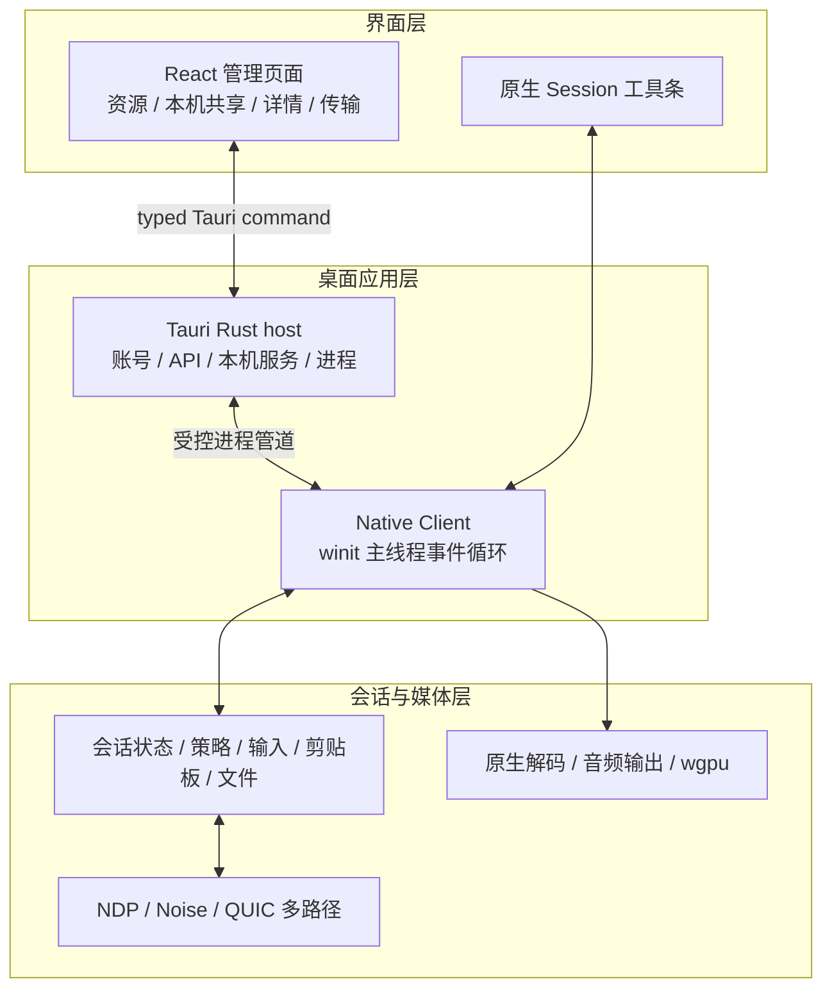
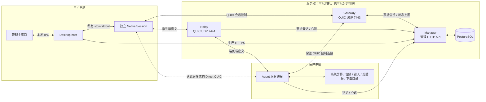
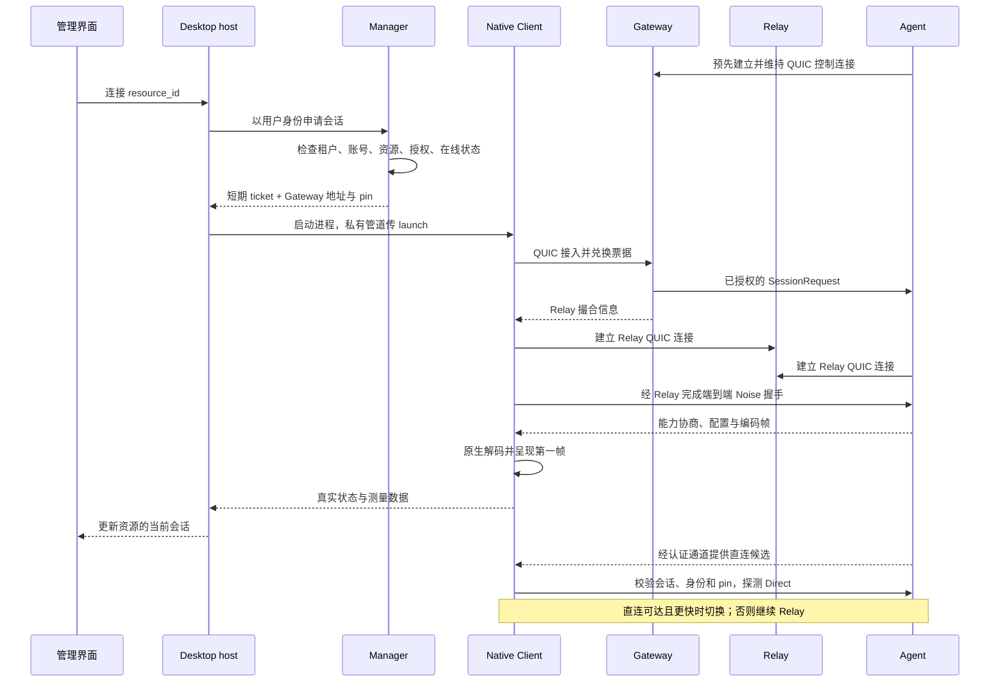
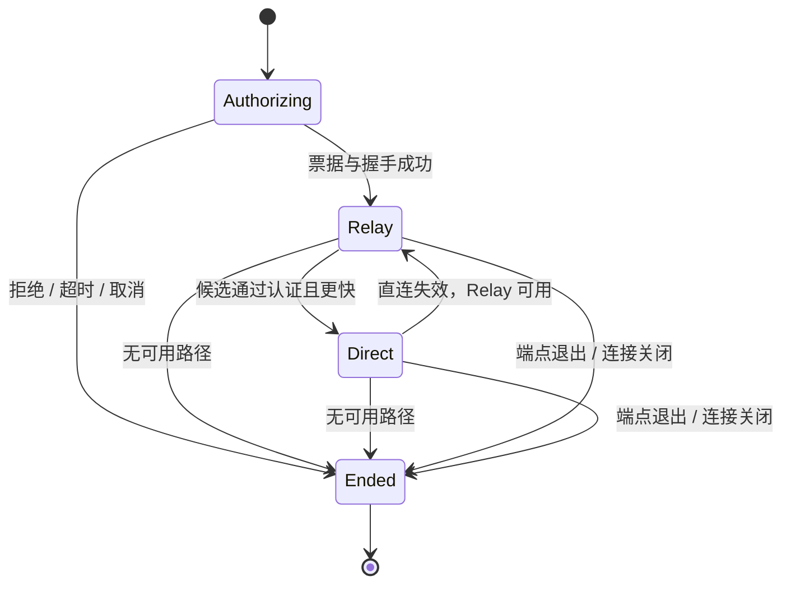
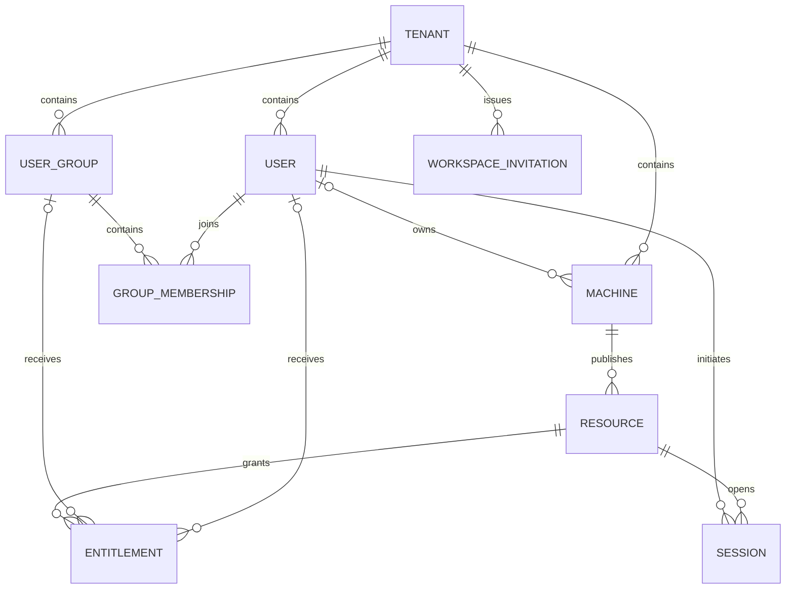

# NebulaDesk：产品工程与运行时架构

本文从产品界面、代码目录和实际进程说明 NebulaDesk 的组成。
协议细节见 [NEBULA_V2.md](NEBULA_V2.md)，桌面调用契约见
[DESKTOP_CONTRACT.md](DESKTOP_CONTRACT.md)，界面基线见
[四张产品设计稿](../../design/product-ui/README.md)。

## 1. 产品由什么组成

用户安装一个桌面产品，使用两类窗口：管理主窗口和独立的远程 Session。
同一台电脑既可以连接别人的资源，也可以运行 Agent，把自己的资源提供出去。
这两个角色互不要求：只做客户端不必开启共享，只做被控机不必保持人工登录。

服务器侧有三个职责，而不是一台包办所有事情的“中转管理服务器”。

| 组件 | 所在位置 | 职责 | 不负责什么 |
| --- | --- | --- | --- |
| Manager | 自建服务器或云端 | 身份、租户、设备、资源、授权、短期会话票据、审计 | 不转发桌面媒体 |
| PostgreSQL | Manager 的受控网络内 | 持久化用户、设备关系、授权及会话记录 | 不对桌面客户端开放 |
| Gateway | 端点可以访问的服务器 | QUIC 接入、Agent 反向控制连接、票据校验、会话生命周期 | 不解码媒体，不是管理页面 |
| Relay | 端点可以访问的服务器 | 转发端到端加密的数据；直连不可用时承载会话 | 不读取桌面、声音、文件或输入 |
| Desktop host | 用户电脑 | 管理 WebView、Manager API、本机操作、Session 子进程 | 不编解码视频 |
| Native Client | 用户电脑，每个 Session 一个进程 | QUIC、解密、原生解码、画面渲染、输入、音频及传输 | 不承载账号管理页面 |
| Agent | 被控电脑 | 注册、采集、编码、输入注入及双向传输 | 不持有人类账号密码 |

小规模部署可把 Manager、Gateway、Relay 放在同一台服务器上，但仍是不同进程、
不同接口。扩容时先按实际负载拆分 Relay；它消耗带宽，Manager 主要消耗数据库和
授权处理资源。当前不需要为了部署方便，把视频绕进 Manager。

## 2. 工程目录与前后端边界

```text
apps/
  desktop-ui/                 React + TypeScript：页面、组件、样式、typed bridge
  desktop-host/               固定版本的桌面打包工具入口，不承载界面代码
crates/
  nebula-desktop/              Rust + Tauri：桌面应用服务与进程管理
    agent-host/                独立的 nebula-desktop-agent 本机共享进程
  nebula-desktop-protocol/     原生 Session 的版本化进程 IPC 类型
  nebula-client/               winit + wgpu：独立 Session、CLI、原生媒体播放
  nebula-agent/                被控服务与 Windows/macOS/Linux 平台后端
  nebula-manager/              axum API、授权、数据库迁移及审计
  nebula-gateway/              QUIC 接入及控制面
  nebula-relay/                密文转发
  nebula-common/              共享标识、策略和控制面类型
  ndp-proto/                  线路消息格式
  ndp-crypto/                 端到端加密和防重放
  ndp-transport/              QUIC 通道、优先级和多路径
  ndp-signal/                 会话建立与信令
design/product-ui/            已确认的四张 SVG 和界面说明
docs/architecture/            产品架构、协议设计和桌面契约
legacy/                      历史实现，不作为新桌面前端依赖
```



React 不直接请求 Manager，不保存 bearer token，也没有任意文件访问或 shell 能力。
它把明确的用户操作交给 Rust，渲染返回的业务数据。登录表单提交密码后清空表单，
不会把密码或票据写到 localStorage、URL 或浏览器日志中。

Rust host 持有身份状态、执行 HTTP 请求、调用原生文件选择器。Session 用独立进程，
不是在 Tauri 的主线程上再启动第二个 winit 事件循环。每个进程拥有自己的原生窗口和
GPU 生命周期；管理页面崩溃或刷新不应重建视频解码器。

两类 IPC 均不传视频帧或音频包。管理页只接收资源、会话状态和传输进度等低频数据。
原生文件路径仅从本机明确操作进入发送流程，不能由远端构造“读取任意本地路径”命令。

服务端和桌面可分别构建。`nebula-desktop` 默认不启用 GUI，避免服务端构建被 Node、
WebKit 或管理页面产物绑住；启用 `gui` 时才引入 Tauri 的窗口和托盘依赖。
打包桌面产品时先构建管理前端和本平台的 Agent/Client，再把原生程序作为 sidecar
放进应用包。开发阶段从工作目录找二进制，不能代替发布包内明确的可执行文件位置。
每个平台必须构建自己的 sidecar，不能把 macOS 二进制带进 Windows 安装包。

桌面产品管理的 Agent 由独立的 `nebula-desktop-agent` helper 运行，它复用
`nebula-agent` 库，不另写采集或传输实现。管理应用退出后，该共享进程可以继续运行；
下次打开应用通过私有、带随机凭据的回环控制端点查询或停止它。
单实例文件锁约束同一身份只运行一个服务，不能靠持久化 PID 后盲目杀进程。
控制端点不承载媒体，也不接受任意命令；凭据与机器身份保存在本机受限文件中，
不交给 WebView。独立部署的 `nebula-agent` CLI 不受这套桌面进程管理接管。

## 3. 服务器与两台电脑的关系



这里的“QUIC-only”指远程会话的数据传输和 Gateway 信令，不是宣称所有 API 都使用 QUIC。
Manager 当前是 HTTP API；生产部署应提供 HTTPS，开发脚本默认使用本机 HTTP。
没有媒体 TCP 回退。网络禁止到 Gateway/Relay 的 UDP 时，应报告连接失败，而不是换成
另一条未说明的慢速通道。

默认端口只是开发配置。发布地址必须是端点实际可达的地址，不能把服务器内部
`127.0.0.1` 当成给远端设备使用的地址。PostgreSQL 只供 Manager 访问。
生产环境不应沿用开发用的 SSH 反向隧道或测试账号。

### 部署配置与拆分顺序

[`deploy/cloud`](../../deploy/cloud/README.md) 提供三个独立 systemd 服务、统一的
地址配置、独立 HTTPS 入口和证书续期定时器。当前示例将三者放在 `47.103.58.159`：
公网 Manager 为 `https://47.103.58.159`（TCP 443），Gateway 为 UDP 7443，
Relay 为 UDP 7444；内部 Manager 只监听 `127.0.0.1:18081`，数据库不对公网开放。
TCP 80 用于 HTTPS 证书挑战。配置示例不代表某次部署已经启动或完成端到端验收。

Manager 独占组织、用户、用户组、设备和授权数据；Gateway/Relay 不各建一套用户库。
Manager 的内部访问地址与公开票据 issuer 分开配置，后者必须保持为公开 HTTPS 地址。
客户端只配置 Manager，节点通过登记和心跳提供可达的地址与证书 pin。
桌面宿主是本机 API 调用层，不是第二个云端 Manager。

现在同机部署便于运维；后续按地域、带宽优先拆分 Relay，再根据连接规模拆 Gateway。
Manager/数据库按控制面负载独立扩容。服务拆分不自动等于高可用，数据库备份、节点
故障切换、共享配置和运维监控仍需单独建设。

## 4. 从点击“连接”到出现画面



“已打开窗口”“完成握手”“收到首帧”和“画面已呈现”是不同事件。UI 不应把
成功启动子进程当成已经连接，也不应把队列里的字节数当作播放延迟。

重复点击同一资源返回已有 Session，不并发创建多条连接；连接不同资源可以打开
不同窗口。连接取消、账号退出和子进程退出都必须清理相应的状态，不能留下永久
“正在连接”的卡片。

## 5. Direct 与 Relay 的职责

首先经 Gateway 授权，并在 Relay 上完成端到端握手，之后才尝试直连。
候选地址来自已认证对端，不扫描局域网，也不根据两端公网 IP 一样就推断可以直连。

当前支持可直接到达的 IPv4 和无 scope 的 IPv6 host 地址，没有 STUN 或 UDP 打洞。
Direct 要校验 TLS pin、Noise 身份、会话标识和监听器绑定，再用实际测量选择路径。
Relay 保持低流量热备，不重复转发整份视频。



路径切换保留逻辑会话和窗口。可靠通道有有界确认、重发和去重，避免重复注入键鼠
或吞掉文件记录；过时音视频不重放，切换后恢复关键帧与解码参考链。
**Gateway 的会话控制连接仍然保留**，不是 Direct 成功后就把所有服务器断开。
两条路径都不可用时明确结束；重新连接是新的授权申请，不伪装成原连接恢复。

路径可靠性和画面流畅度是两个问题。已有回退机制不等于公网持续帧率和端到端延迟
已达到目标；这部分优化与桌面界面独立推进。

## 6. 用户、设备、资源与权限



机器是资源的宿主，资源才是客户端申请连接的对象。资源可以是桌面，也可以是应用的
发布记录；应用的执行路径属于所有者配置，不必暴露给仅有使用权限的人。
每条授权指向用户或组之一；用户组通过成员关系参与服务端资源权限计算。
删除组会在一个事务中撤销其资源授权并删除成员关系，不删除成员账号。

工作空间对应现有 tenant，类型为 `PERSONAL` 或 `ORGANIZATION`。
自助注册在同一事务中创建新空间、`ADMIN` 所有者和登录凭据，默认关闭，部署者需显式
开启。组织管理员通过 48 小时有效、绑定邮箱、一次性的邀请创建普通 `USER`；
数据库只存邀请码 hash，撤销、到期、重复使用及邮箱不匹配都不能加入。
旧 `OWNER` 角色保留管理员权限，但新账号不自行选择管理员角色。
账号设置仅向组织管理员开放成员和用户组管理，不向普通成员暴露目录枚举。

当前账号归属于一个工作空间，同一邮箱跨空间并非同一个全局账号；
没有多组织 membership 切换、自动邀请邮件、邮箱验证或密码找回。
旧数据升级前必须执行只读邮箱唯一性预检，并暂停旧版本目录写入。
遇到同空间大小写或首尾空白导致的重复邮箱，应人工确认后修正，不能自动合并账号；
具体步骤见云端部署文档。

Manager 根据当前数据库关系判定所有权、授权和会话策略，不信任前端的“我是所有者”
标志。所有操作都在租户范围内执行。拥有某台设备不意味着可以管理整个用户目录；
向指定用户共享时按本租户内的确切邮箱解析，不提供跨租户搜索。

Agent 通过一次性注册令牌取得自己的机器身份，不使用人类的 access token 常驻运行。
桌面「注册本机」显式指定当前用户为设备所有者，并显示所属空间，管理员注册也不例外。
其他空间的既有本机身份不会被登录新账号自动接管；注册账号与开启共享是独立步骤。
用户退出管理账号与撤销设备身份是两件事。移除设备、关闭共享、删除资源、撤销某人的
授权也有不同影响，界面应分别说明并确认，而不是用一个无差别“删除”操作。

**授权按会话边界生效，是已确认的产品行为，不是待补的实时撤权功能。**
Manager 在申请新会话时检查最新授权，已建立的连接沿用其权限快照；撤销资源授权不会
主动踢出已有会话。Direct/Relay 路径切换不算新会话，结束后再次连接则必须重新申请。
已经签发但尚未使用的票据仍按原短有效期和单次兑换规则处理，不增加即时吊销。
资源停用和设备移除也会阻止新的 Manager 会话申请。要立即终止被控端现有连接，
应明确停止该设备的 Agent 共享服务，不能把修改授权记录宣称为已经踢出对端。

## 7. 窗口与后台服务生命周期

| 操作 | 预期影响 |
| --- | --- |
| 打开管理主窗口 | 进入账号、资源和本机共享界面，不自动申请远程会话 |
| 关闭管理主窗口 | 隐藏管理窗口；不等于停掉本机共享 |
| 关闭 Session | 只结束该连接并释放输入状态、媒体和传输任务 |
| 返回已有 Session | 聚焦原生窗口，不重新登录、不重新申请票据 |
| 退出账号 | 明确提示并关闭该账号的客户端连接，清除人工登录状态 |
| 停止本机共享 | 明确的本机操作，停止受本应用管理的 Agent，不按进程名误杀外部服务 |
| 明确退出桌面应用 | 提示仍在运行的客户端连接，并完成子进程清理 |

Session 管道使用版本化、有界 NDJSON；首条是启动请求，此后是聚焦、断开、声音、
剪贴板和文件发送命令。标准输出专用于协议，诊断写入标准错误。启动票据不能放进
命令行参数。宿主退出导致管道 EOF 时，会话子进程应结束，不能留下无人管理的窗口。

本机共享只能声明实际掌握的状态。macOS 通过无提示的公开 API 查询当前应用的屏幕录制
与辅助功能授权；无法确定的权限仍显示未知，音频不由屏幕授权推断。不能因
Agent 进程启动成功就显示所有权限已开启。系统授权仍由操作系统处理，应用不修改
权限数据库、默认音频设备或网络防火墙来规避权限。

## 8. 媒体、输入和传输

视频保留平台采集/编码、QUIC 传输、原生解码及 wgpu 呈现路径。
视频帧使用独立 QUIC 流，控制与输入有自己的可靠通道和调度优先级；
音频使用 Opus 与 QUIC datagram。界面改动不把原生媒体替换成浏览器录屏或图片轮询。

文字、图片剪贴板和文件的权限独立于画面。macOS 支持 Finder Copy 文件与会话拖入，
接收文件进入 `Downloads/NebulaDesk`；这不是把任意路径透传给远端系统的文件管理器。
完成状态以接收端校验并最终确认成功为准，发送完最后一块不等于成功。
文件名冲突应保留已有内容，传输错误、取消和超时必须释放任务额度。

当前 macOS 键盘按物理键转发，使用远端布局；本地 IME composition/commit 转发尚未完成。
系统音频输出正常与否也不能单凭“采集器启动”判断；实时界面不伪造音频活动或测速值。

## 9. 当前边界与后续扩展

四张设计稿确定布局和主要操作，不把尚未完成的底层能力变成现成承诺：

- 单应用发布元数据和按用户授权，与单应用启动、窗口隔离和串流分别实现；
  后者未完成时，APP 卡片明确不可连接，绝不改连整个桌面。
- 三平台代码构建与实际 GPU、桌面授权、硬件音视频验收不是同一件事。
- OS 自启动服务安装、更新签名和企业分发需要各平台的正式打包方案，
  不能把开发时启动的 Agent 称为已经安装系统服务。
- NAT 打洞、跨网持续视频性能和完整 IME 输入各有独立边界，不借 UI 任务暗中扩大范围。

### 2026-09-09 交付后的未完成项

本轮已通过的 Mac 图形界面、音频、剪贴板和文件结果见
[README 验收记录](../../README.md#packaged-mac-acceptance-2026-09-09)。
本次实际媒体路径是局域网直连，不能将它当作公网中继验收。

| 未完成项 | 当前边界 |
| --- | --- |
| 当前 Mac 包的键鼠验收 | 辅助功能授权仍需用户确认；授权后重连，复测键入、快捷键、点击、拖动、滚轮和失焦释放。 |
| 修正版 App 正式替换 | `7ffafff` 签名开发包已暂存于双方交付目录，尚未替换运行中的 App；需要重新启动、必要时重新登录和授权，再验收修正版。 |
| 单应用连接 | 已有发布记录和按用户/组授权；应用启动、窗口隔离、单应用捕获与串流尚未完成。 |
| 公网与跨 NAT | 持续视频帧率、端到端延迟、拥塞/丢包下恢复仍待优化和验收；现有 Direct/Relay 切换不等于已完成 NAT 打洞。 |
| 输入法 | 尚无 Client 侧 IME composition/commit 转发，当前使用远端布局的物理键。 |
| Windows/Linux 真机 | 后端与构建已接入，仍缺实际桌面、GPU、系统权限及跨平台互通验收。 |
| 正式安装与分发 | 当前 macOS 使用临时签名开发包；正式签名/公证、安装升级、系统自启动服务和企业分发尚未完整交付。 |
| 账号后续能力 | 自动邀请邮件、邮箱验证、密码找回、同一全局账号跨多个工作空间切换尚未实现。 |

后续增加管理员 Web 控制台时，可复用 Manager API 和部分展示组件，但不应复用桌面
本地特权桥接能力。增加应用串流时，应扩展 Agent 的资源启动与捕获后端以及能力协商，
而不是让前端根据应用名猜测一个远程执行命令。

## 10. 单应用连接的跨平台设计建议

以下是设计方向，不代表已经实现或完成三平台验收。先用两台 Mac 验证公共契约及 macOS
后端，Windows/Linux 必须保留独立后端和真实能力检查，不能用编译成功冒充功能可用。

### 10.1 复用边界

保留 Manager 的资源与授权、Gateway 撮合、Relay 密文转发及 Client 原生解码渲染。
现有 `media.rs` 已用 `Platform`、`VideoSource`、`AudioSource`、`InputInjector` 分离平台；
需要补的是会话目标、应用生命周期、窗口集合与输入作用域，而非另写一套传输协议。

| 概念 / 拟议接口 | 职责 |
| --- | --- |
| `SessionTarget` | 区分桌面与应用资源；目标绑定已授权资源及其发布版本，不接收 Client 提供的任意命令行。 |
| `ApplicationHost` | 平台适配层解析受信任发布配置并启动/绑定应用，返回 `ApplicationInstance`；路径和参数分别处理，不拼接 shell 命令。 |
| `ApplicationInstance` | 持有本次启动的实例身份、所有权和生命周期；不能仅凭 PID 或应用名认领用户已经打开的其他窗口。 |
| `SurfaceRegistry` | 追踪获准主窗口、子窗口、尺寸、DPI、层叠与销毁；用稳定的会话内 `SurfaceId` 和几何版本屏蔽原生句柄。 |
| `PlatformSession` | 从现有 `Platform::session_scope` 演进，持有本会话的捕获、输入、音频和 OS 授权资源。 |
| `AppSession` | 编排启动、等待窗口、媒体建立、窗口变更和清理；复用当前会话媒体管线。 |
| 能力协商 | 分别报告窗口捕获、窗口输入、子窗口、应用音频和隔离等级；按资源实际需求决定是否允许连接。 |

发布配置或目标版本在票据签发后发生变化时，不得静默执行另一份程序；Agent 必须校验
授权目标和解析出的启动计划一致。断连默认释放会话资源，不强杀用户原有进程；
是否关闭本次独占启动的应用应由明确的生命周期策略控制。

### 10.2 三平台后端

| 平台 | 原生方向 | 必须显式处理的差异 |
| --- | --- | --- |
| macOS | LaunchServices / NSWorkspace；ScreenCaptureKit 窗口捕获；Accessibility 与 CoreGraphics 输入 | 应用复用旧进程、多个文档窗口、弹窗归属、焦点和坐标变化；窗口捕获不等于安全沙箱。 |
| Windows | Win32 启动与窗口跟踪；Windows.Graphics.Capture 的 `CreateForWindow`；窗口/输入 API | 多进程应用、owned windows、DPI、UIPI 与 UAC；不能假定 `SendInput` 只影响目标窗口。 |
| Linux Wayland | 应用启动；ScreenCast Portal 的窗口选择、PipeWire；RemoteDesktop Portal / libei | 标准 Portal 不保证按任意 PID 无人值守选窗或应用级输入隔离；依赖 compositor 的能力，不能照搬 Win32。 |

Linux 首期需要明确支持的 compositor/portal 组合；在不满足目标绑定和控制要求的环境
中返回不支持或明确需要本机选择，不得偷偷改为全屏共享。无人值守和独立用户桌面可通过
后续专用 compositor / 隔离桌面后端扩展，但不是标准窗口 Portal 自动提供的能力。

### 10.3 呈现、输入和隐私

建议第一阶段仍使用一个 Client 原生会话窗口，内部模型从一开始支持多个 `Surface`。
获准窗口可在 Agent GPU 上合成为应用画布后沿用一条硬件编码视频流；不先承诺每个
远端窗口都映射为本地独立窗口。未经确认归属的窗口、菜单和系统弹窗不能自动加入。

输入携带目标 Surface 和几何版本，在 Agent 校验后才转换坐标；窗口失效、归属不明、
版本过期或焦点无法确认时停止投递并反馈状态，不能落到桌面。音频应按应用/进程作用域
捕获，不支持时明确禁用，不能退回整机系统声音。应用模式也不能直接沿用整机全局
剪贴板自动同步，应默认关闭，后续以明确作用域和用户同意接入。

**单应用呈现与多用户安全隔离是不同能力。** 共享同一个 OS 登录会话时，即使只采集一个
窗口，也无法由此保证文件访问、系统对话框、其他应用启动和并发输入的安全隔离。
首期共享桌面模式应限制为受信任用户，并对同一 OS 交互桌面的控制会话采用独占租约；
面向不可信用户的应用发布必须依赖独立 OS 会话、沙箱或虚拟机等另行设计的隔离环境。

### 10.4 推荐落地顺序

1. 定义目标、实例、Surface、能力协商及失败状态；桌面路径保持不变，APP 默认仍禁用。
2. 在 Mac 上实现一个受控应用的启动、窗口绑定、捕获和基础输入，验证缩放与关闭流程。
3. 验证多窗口/弹窗、最小化、焦点竞争、应用退出、断连清理，以及不捕获无关窗口。
4. 按已验证公共契约实现 Windows/Linux 后端；仅对满足能力和隔离要求的资源启用 APP。
5. 单独推进应用音频、受限剪贴板和更强隔离，不把桌面模式的权限直接搬进应用模式。
